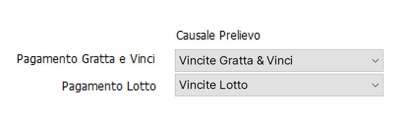
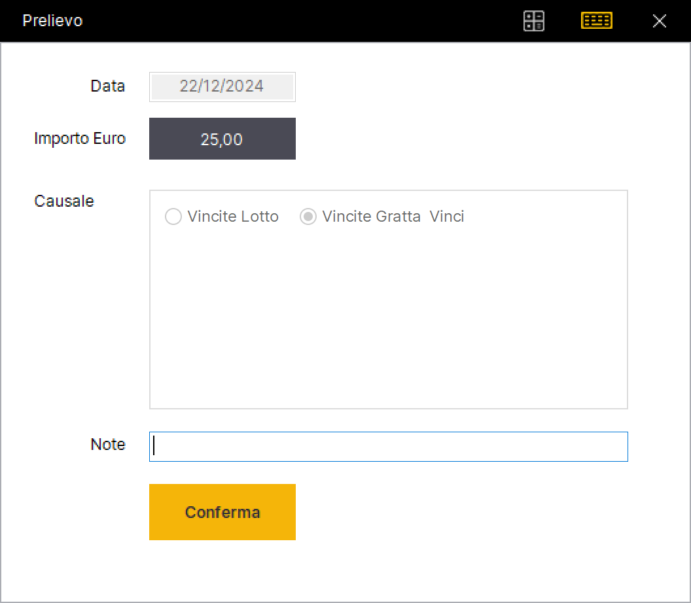
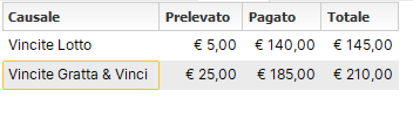
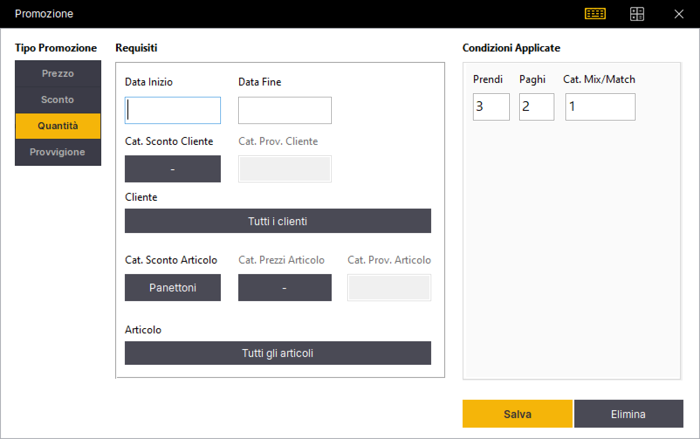
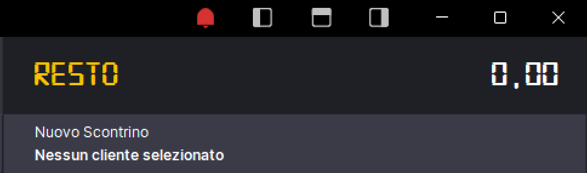
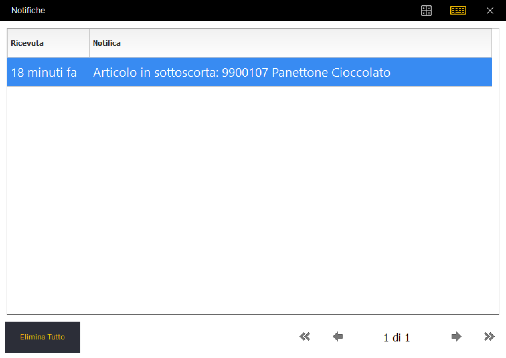
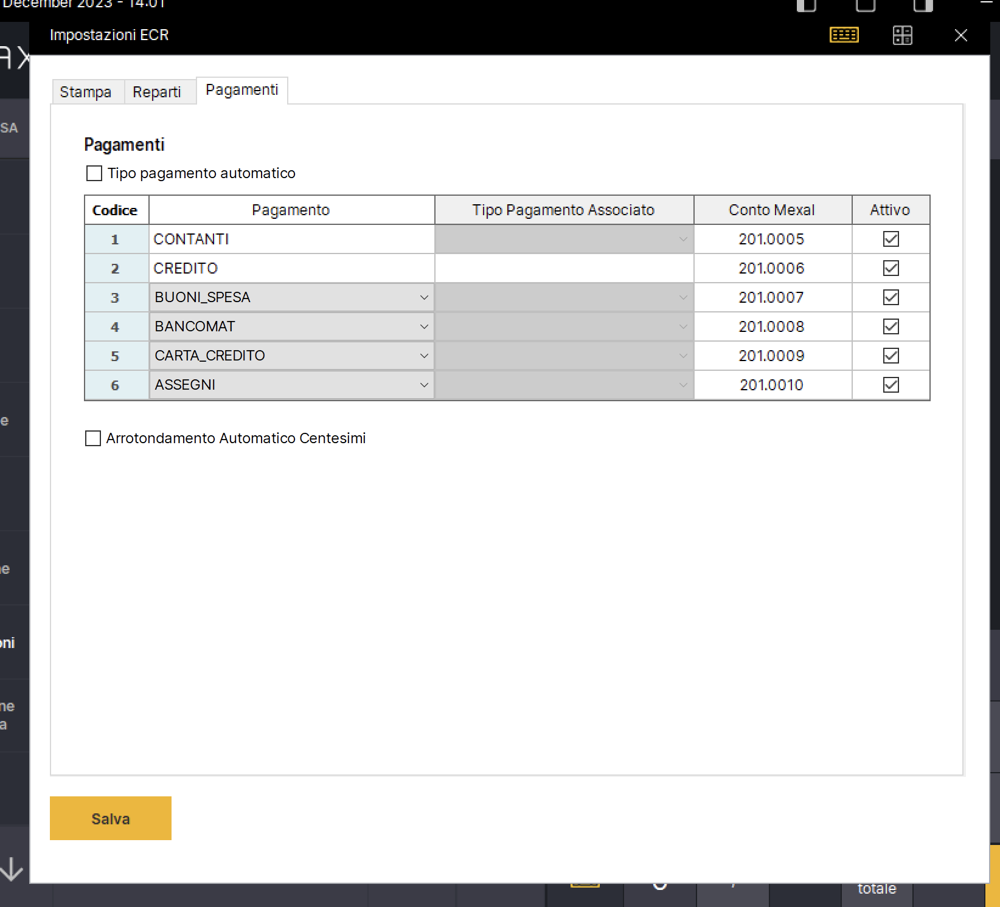
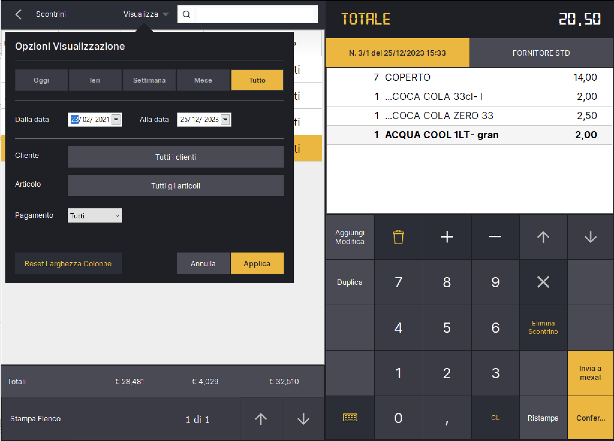

# 🆕 Aggiornamenti Relax

## Relax 15.8.2 - 8 Maggio 2026

**Maggiorazione documento e riga (DB 15.8.2):**

* Aggiunte quattro nuove azioni speculari allo Sconto: **Magg. Riga %**, **Magg. Riga €**, **Magg. Doc %**, **Magg. Doc €**. Possono essere inserite nella sidebar della cassa come pulsanti.
* La maggiorazione può essere applicata a livello di singola riga (percentuale o valore) oppure dopo il subtotale, dove crea una riga "MAGGIORA" collegata che incrementa il totale (specchio della riga SCONTO).
* La maggiorazione di riga e quella sul documento vengono persistite (`documenti_righe.MaggiorazionePercentuale`, `documenti_righe.MaggiorazioneValore`, `documenti.Maggiorazione`) e mostrate sullo scontrino in cassa accanto allo sconto.

**Varianti articolo - Gratuite, sempre a pagamento, ordinamento (DB 15.8.0 e 15.8.1):**

* Aggiunto in anagrafica articoli il campo **Numero di varianti gratuite**: quando si aggiungono varianti a un articolo, le prime N varianti non vengono addebitate.
* Aggiunto in anagrafica varianti il flag **Sempre a pagamento**: la variante viene sempre addebitata e non rientra nel conteggio delle gratuite.
* Aggiunto in anagrafica varianti il campo **Ordinamento** (default 1000, coerente con articoli e categorie): controlla l'ordine in cui le varianti appaiono sia nel selettore desktop sia nel mobile.
* La logica delle varianti gratuite funziona in modo identico sia da desktop (cassa) sia da mobile (Relax Mobile via REST).
* Il `PadreID` delle righe variante viene ora settato anche dal flusso mobile, allineandolo al desktop. Questo permette di modificare correttamente una comanda creata da mobile e di mantenere il conteggio delle varianti gratuite quando si mescolano i due canali.

**Impostazioni Scontrino - Inserimento articoli solo tramite codice a barre:**

* Nuovo flag in Impostazioni Scontrino. Quando attivo, blocca l'aggiunta di articoli via click su pulsantiera, griglia e PLU; resta possibile aggiungere articoli solo tramite codice a barre digitato o sparato con lettore nel campo di ricerca.
* Se l'utente prova a cliccare un articolo viene mostrato un messaggio esplicativo.

**Stampa scontrino - Arrotondamento allineato al misuratore fiscale:**

* Risolto un problema di differenze di 1 centesimo tra il totale calcolato da Relax e quello stampato dal misuratore fiscale. Il calcolo dell'importo riga adesso pre-arrotonda a 2 decimali subito dopo `qta × prezzo`, esattamente come fa il misuratore fiscale prima di applicare gli sconti percentuali.

**Listini cliente fuori range:**

* Se l'anagrafica di un cliente contiene un valore di listino fuori dal range supportato (1..9), Relax non genera più l'errore `Field not found : ListinoNN` ma mostra un messaggio chiaro indicando il valore non valido e ripiega sul listino predefinito, lasciando il programma utilizzabile.

**Impostazioni Stampanti - Crash su scroll combo:**

* Risolto il crash che si verificava aprendo le tendine in Impostazioni Stampanti e scorrendo con le frecce. La cascata di eventi `OnChange` che innescava scritture multiple sul file XML ad ogni freccia, e un'eccezione fatale non catturata in caso di stato transitorio, sono state messe in sicurezza.

**Tavoli - Tavolo blu permanente dopo conto separato:**

* Risolto il problema per cui dopo aver chiuso completamente una comanda con conto separato e uscito dal form via "Indietro", il tavolo restava nello stato "occupato" (colore blu). Il tavolo ora torna correttamente libero quando la comanda è stata interamente pagata.

**Produzione automatica - Carico/Scarico Lavorazione duplicati su Mexal:**

* Risolto un bug per cui ad ogni nuovo scontrino con articoli di produzione, Relax rigenerava i file JSON Mexal Shaker anche per i Carico/Scarico Lavorazione degli scontrini precedenti, causando documenti duplicati lato Mexal. Gli scontrini secondari accumulati in memoria vengono ora correttamente liberati tra uno scontrino e l'altro.

## Relax 15.7.8 - 29 Marzo 2026

**Welcome - Conti Passanti:**

* Aggiunto supporto per i conti passanti nel form di pagamento addebito in camera. È ora disponibile una nuova tab "Conti Passanti" accanto alla tab "Camere", che permette di addebitare direttamente su un conto passante Welcome.
* I conti passanti vengono caricati in background tramite un thread dedicato e sono visibili solo al primo accesso alla tab.

**Welcome - Salvataggio cliente sul documento (DB 15.7.8):**

* I dati del cliente Welcome (OID, nome, cognome) vengono ora salvati direttamente sul documento al momento dell'addebito in camera (`WelcomeClienteOid`, `WelcomeClienteNome`, `WelcomeClienteCognome`).
* Il form documento mostra il cliente Welcome associato.

**Welcome - Annullo documento migliorato:**

* L'annullo di un documento Welcome ora usa il cliente salvato direttamente sul documento invece di cercarlo in tempo reale tramite le risorse occupate. Per i documenti salvati con versioni precedenti, viene mantenuto il vecchio comportamento di fallback tramite la camera.

**Scontrino di Cortesia - Stampa:**

* Implementata l'azione "Stampa Scontrino di Cortesia" (`caStampaProforma`): se aggiunta alla sidebar, ora esegue effettivamente la stampa del proforma.

**Tipo Documento - Ricerca Persone:**

* Il campo di ricerca persone nel form selezione tipo documento ora filtra per denominazione, P.IVA e codice fiscale contemporaneamente.

## Relax 15.7.6 - 22 Marzo 2026

**Welcome - Annullo addebito:**

* Aggiunta la funzionalità di annullo documento su Welcome durante eliminazione di un documento in Relax. Le righe precedentemente inviate a Welcome vengono annullate automaticamente tramite API con quantità negative.
* Aggiunte le colonne `WelcomeAnnulloStatoId`, `WelcomeAnnulloId` e `WelcomeAnnulloRisposta` sulle righe documento per tracciare lo stato dell'annullo.
* Corretto il calcolo dell'importo inviato a Welcome: ora viene inviato il prezzo unitario scontato (`PrezzoScontato`) invece dell'importo totale della riga.

**Documenti - Colonna Camera:**

* Aggiunta la colonna "Camera" nella lista documenti, visibile solo quando il modulo Welcome è attivo.
* La ricerca documenti ora include anche il campo Camera.

**Documenti - Ordinamento:**

* Modificato l'ordinamento predefinito della lista documenti in Gestione: ora ordina per ID decrescente (dal più recente) invece che per data e numero.

**Rinomina Proforma -> Scontrino di Cortesia:**

* Le impostazioni "Richiedi Riferimenti Scontrino in Proforma" e "Descrizione Proforma" sono state rinominate in "Scontrino di Cortesia" sia nell'interfaccia che nel database (aggiornamento DB 15.7.5).

**Pulsante Dettagli Magazzini:**

* Aggiunto il pulsante "Dettagli Magazzini" nel form riga documento, che apre la schermata con i dettagli delle giacenze per magazzino dell'articolo selezionato.

**Impostazioni Mexal Avanzate - Ristrutturazione UI:**

* La schermata delle impostazioni Mexal avanzate è stata riorganizzata con un sistema a tab (Generale, Articoli, Clienti, Operatori, Documenti) per migliorare la navigabilità.

**Importazione Mexal - Nuovi campi videate personalizzate articoli:**

* Aggiunta la possibilità di configurare i campi Mexal per: Non Disponibile, Campionario, Componente, Mostra in Relax Mobile e Ordinamento.
* Questi campi, precedentemente hardcoded a valori fissi, vengono ora letti dalle videate personalizzate di Mexal durante l'importazione articoli.

## Relax 15.7.3 - 9 Marzo 2026

* Aggiunto il campo Reparto in Impostazioni Welcome, se valorizzato con un numero maggiore di zero viene mandato per ogni addebito a Welcome.
* Analisi Redditivitá le colonne relative al costo articoli rappresentano il costo totale (costo unitario per quantitá venduta).

## Relax 15.7.2 - 2 Marzo 2026

* In Analisi Redditivitá sono stati aggiunti i campi **Totale Ricavi** e **Utile** (differenza ricavi - costi) nel pannello riepilogativo in alto.
* Corretto problema aggiornamento licenze da Relax Cloud.
* Corretta la visualizzazione voucher nella griglia pagamenti: vengono mostrati solo i buoni spesa con un **VoucherCloudId valido**

## Relax 15.7.1 - 17 Febbraio 2026

* Aggiunto controllo sulla lunghezza del barcode in fase di generazione alias articoli
* Altre correzioni varie

## Relax 15.6.9 - 13 Gennaio 2026

* Sistemato problema in fase di reso merce articoli con produzione (Ricevuta Fiscale per annullo addebito Welcome)
* Conto alla romana: é possibile ora impostare q.ta ad 1 per creare un scontrino con unico coperto.&#x20;
* Sistemato invio sezionale documento di bolla di scarico generato a partire dal documento bolla di scarico conto alla romana
* La camera viene mandata a Mexal nel campo Note del documento.

## Relax 15.6.7 - 11 Gennaio 2026

* Sconto Cliente in fase di comanda, viene applicato in fase di stampa preconto o in fase di generazione conto.
* Generazione file shaker json per documento bolla di scarico generato a partire dal conto alla romana
* Nuova azione Reso Merce da aggiungere opzionalmente alla sidebar
* Viene mandato il numero della camera nelle note Welcome
* Altri bugfix vari

## Relax 15.6.6 - 04 Gennaio 2026

* Migliorata maschera addebito in camera Welcome: ora è possibile cercare rapidamente le camere digitando numero camera o nome cliente
* Le camere occupate vengono caricate automaticamente da Welcome in tempo reale tramite API /ContiAperti, senza bisogno di sincronizzare
* Le camere sono ora ordinate per numero camera per facilitare la ricerca
* Migliorata visualizzazione con paginazione automatica per gestire hotel con molte camere
* La descrizione dell'articolo viene ora inviata nelle note dell'addebito a Welcome
* Il documento corrente (scontrino, fattura, ecc.) viene automaticamente convertito in Ricevuta Fiscale quando si utilizza il pagamento addebito in camera
* Gestione intelligente dei conti aperti: vengono automaticamente filtrati i conti già in checkout (data corrente > data partenza) e i conti eliminati
* In caso di più conti aperti sulla stessa camera, viene selezionato automaticamente il conto più recente (OID maggiore)
* Per ogni camera occupata vengono visualizzati: numero camera, nome e cognome cliente, e descrizione trattamento

## Relax 15.5.7 - 14 Dicembre 2025

* Aggiunto flag Applica Promozioni agli articoli Buoni Spesa in Impostazioni Fidelity
* Aggiunta la possibilitá di personalizzare ed aggiungere nuove fasce orarie (Gestione->Tabelle->Fasce Orarie)
* Aggiunti Modificatori Articoli in Gestione->Tabelle->Modificatori
* Aggiunta la scheda Modificatori in anagrafica Articolo
* Relax Server restituisce ora il campo Preferito durante il sync articoli

## Relax 15.5.3 - 08 Dicembre 2025

**Analisi Redditività Prodotti:**  é stato migliorato il calcolo dei **costi indiretti** importati dalle fatture fornitori, introducendo il **calcolo proporzionale basato sulle date di competenza.**

* Sono stati aggiunti i campi Data Competenza Inizio e Data Competenza Fine:
  * Quando si seleziona il tipo documento dalla fase cassa ed il tipo documento é Fattura Fornitore o Bolla fornitore. I dati vengono chiesti nell'ultimo step insieme al numero documento e data.
  * Nel dettaglio documento in fase gestione, scheda "Altro"
* Sistemato il problema importazione Descrizione riga vuota nel tasto "Usa da fatture"
* Sistemata dimensione griglia articoli / maschera articoli
* Altre correzioni minori

#### Comportamento Precedente

Quando si utilizzava il pulsante "Usa da Fatture", il sistema importava l'importo totale di ogni fattura di spesa, indipendentemente dal periodo di competenza del costo rispetto al periodo di analisi selezionato.

#### Comportamento Attuale

Il sistema ora:

1. **Filtra** solo le fatture con date di competenza che ricadono (anche parzialmente) nel periodo di analisi
2. **Calcola** il costo giornaliero della fattura
3. **Determina** quanti giorni di competenza cadono effettivamente nel periodo analizzato
4. **Importa** solo la quota proporzionale del costo

#### Esempio 1 : Affitto Mensile

**Fattura:** Affitto Dicembre 2024

* Importo: **€ 2.500,00**
* Competenza: 01/12/2024 - 31/12/2024 (31 giorni)
* Periodo analisi: 01/12/2024 - 31/12/2024

**Calcolo:**

* Giorni totali: 31
* Giorni nel periodo: 31
* Costo giornaliero: €2.500,00 ÷ 31 = €80,65
* **Costo importato: €2.500,00** (100% del costo)

#### Esempio 2: Assicurazione Semestrale (Competenza Parziale Inizio)

**Fattura:** Assicurazione Semestrale

* Importo: **€ 3.000,00**
* Competenza: 01/10/2024 - 31/03/2025 (182 giorni)
* Periodo analisi: 01/01/2025 - 31/01/2025

**Calcolo:**

* Giorni totali: 182
* Giorni nel periodo: 31 (solo gennaio 2025)
* Costo giornaliero: €3.000,00 ÷ 182 = €16,48
* **Costo importato: €510,88** (17% del costo)

### Note Finali:

* Le fatture **senza date di competenza** vengono **escluse** dall'importazione automatica
* Il calcolo considera i giorni di calendario (inclusi weekend e festivi)
* La formula utilizzata: `Costo Finale = (Importo ÷ Giorni Totali Competenza) × Giorni nel Periodo`
* I log di debug riportano tutti i dettagli dei calcoli per ogni fattura processata

## Relax 15.4.9 - 19 Novembre 2025

Aggiunta la nuova funzionalitá di **Analisi Redditività Prodotti**

È stata aggiunta una nuova maschera di analisi per il calcolo dettagliato della redditività dei singoli prodotti. Questa funzionalità è accessibile da Gestione > Statistiche > Dashboard, dove sono presenti quattro riquadri che mostrano i dati relativi a periodi diversi (Giornaliero, Settimanale, Mensile, Annuale). Ogni riquadro contiene un pulsante "Analisi Redditività" che consente di accedere alla maschera dedicata.

La nuova maschera consente di analizzare la marginalità di ciascun prodotto calcolando automaticamente i costi diretti (materie prime) e ripartendo i costi indiretti (affitto, utenze, personale, ecc.) sulla base delle quantità vendute. L'utente ha la possibilità di:

* Inserire manualmente i costi indiretti tramite una sezione editabile con pulsanti per aggiungere, rimuovere.
* Filtrare gli articoli per categoria
* Ordinare i risultati per margine percentuale, ricavo, quantità venduta o nome
* Applicare filtri aggiuntivi come "Solo margine < 40%" e "Solo in perdita"
* Visualizzare il dettaglio completo di ogni articolo con il breakdown dei costi (costi diretti, indiretti e totali) tramite doppio clic sulla riga

I costi indiretti vengono inseriti manualmente per il periodo specifico di analisi e non vengono salvati permanentemente nel database al momento.

## Relax 15.2.7 - 04 Settembre 2025

* Aggiunto il totale delle vendite nella fase di verifica cassa e restyle grafico
* Aggiunto il campo Totale Comande Eliminate nella scheda ristorante della verifica di cassa
* Aggiunto nuovo flag "Disattiva Guadagno Punti" in tab Fidelity anagrafica Clienti, che consente di escludere dall'attribuzione punti dei clienti specifici
* Aggiunto nuovo flag "Memorizza Comande Eliminate" in Impostazioni Ristorante.
* Bugfix: riporto il codice del buono spesa associato al voucher in fase di riscatto
* Gestito il caso in cui si vuole fare il reso di un voucher (Documento Reso corrispettivo)

## Relax 15.2.5 - 07 Agosto 2025

* Ottimizzazione ricerca fase Cassa: implementata ricerca avanzata con supporto per query multi-termine e operatore AND automatico per risultati più accurati. Il sistema ora supporta query testuali complesse come per esempio "Batteria al litio", effettuando automaticamente la ricerca delle singole parole con operatore AND logico per garantire risultati più completi e pertinenti.
* Risolto problema su annullo di uno scontrino con voucher
* Risolto problema aggiunta multipa  dello stesso voucher in fase di pagamento
* Se in un documento viene utilizzato il tipo pagamento voucher, non vengono ora guadagnati i punti fidelity in fase di conferma scontrino
* Aggiunto pulsante "Cambio Destinazione" in Dettaglio documento che consente di selezionare un indirizzo di destinazione diverso tra quelli disponibili per il cliente selezionato.&#x20;
* Sistemato problema in fase di ricerca nella fase storico acquisti e vendite.&#x20;

## Relax 15.2.1 - 31 Luglio 2025

* In Impostazioni Fidelity sono stati aggiunti quattro nuovi parametri,  abbiamo ora la possibilitá di definire le seguenti:
  * A = Quanti punti si guadagnano per ogni B euro spesi;
  * B = Quanto bisogna spendere per guadagnare A punti;
  * C = Quanti punti si guadagnano per ogni D unitá acquistate;
  * D = Quante unitá bisogna acquistare per guadagnare C punti.

Nell'immagine in basso A = 2, B=50, C=1, D=3:

<figure><figcaption></figcaption></figure>

Questi 4 campi sostituiscono la precedente Soglia Punti/Euro. Il programma di aggiornamento si occupa di riportare automaticamente la precedente soglia e settare opportunamente i nuovi campi in modo da mantenere la compatibilitá con le versioni precedenti. Questi 4 campi permettono ora di gestire 4 casistiche differenti in una maniera piú flessibile:

<table><thead><tr><th width="81.982421875">A</th><th width="61.3807373046875">B</th><th width="65.71099853515625">C</th><th width="60.7916259765625">D</th><th>Note</th></tr></thead><tbody><tr><td>0</td><td>0</td><td>0</td><td>0</td><td>Fidelity disattivata</td></tr><tr><td>>0</td><td>>0</td><td>0</td><td>0</td><td>Guadagno punti in base ad importo speso (Modalitá presente anche nella precedente versione ma piú flssibile), B equivale al precedente parametro Soglia Punti/Euro, ora si puó definire quanti punti per importo speso vengono assegnati</td></tr><tr><td>0</td><td>0</td><td>>0</td><td>>0</td><td>Nuova modalitá introdotta da questa versione che permette di assegnare C punti per ogni D unitá acquistate</td></tr><tr><td>>0</td><td>>0</td><td>>0</td><td>>0</td><td>Entrambe le modalitá sono attive, verranno assegnati dei punti sia in base alla quantitá venduta che al totale del documento emesso.</td></tr></tbody></table>

* Sistemato problema su numero massimo di punti per scontrino
* Tra i criteri che permettono di definire quali articoli vanno inclusi nel calcolo dei punti guadagnati é stato aggiunto un nuovo campo: **Prezzo Minimo (Iva Inclusa)**.&#x20;

Adesso nella definizione di un criterio di inclusione si puó quindi indicare: o la categoria articoli o il prezzo minimo, oppure entrambi.&#x20;

Affinché un criterio sia soddisfatto e l'articolo venga incluso nel calcolo dei punti guadagnati \*entrambi\* i criteri indicati devono essere soddisfatti dall'articolo **(AND logico)**.&#x20;

Facciamo un esempio: se creo un criterio con la categoria "Gioielli" e il prezzo minimo "50,00 euro", soltanto gli articoli che appartengono alla categoria "Gioielli" venduti a piú di 50 euro genereranno punti.&#x20;

Se definisco un secondo criterio, per esempio indicando solo la categoria "Orologi" e lasciando libero il campo Prezzo Minimo, adesso nel calcolo dei punti guadagnati entreranno tutti i Gioielli da almeno 50 euro e tutti gli orologi (a qualunque prezzo venduto). Criteri diversi creano quindi un **OR logico**.&#x20;

<figure><figcaption></figcaption></figure>

* Aggiunto il tasto "Indirizzi" in anagrafica clienti, in questa fase é possibile definire un insieme di indirizzi legali al cliente da usare per la spedizione della merce acquistata.

<figure><figcaption></figcaption></figure>

* Si puó scegliere uno tra gli indirizzi di spedizione come predefinito nella maschera principale dell'anagrafica cliente. Questo indirizzo verrá usato in fase di vendita nella nuova scheda Destinazione. Il campo é opzionale e se lasciato vuoto verrá usato l'indirizzo principale come destinazione merce
* In dettaglio documento (tasto display in cassa) é stata aggiunta la scheda Destinazione dove viene riportato l'indirizzo di destinazione predefinito, questi dati vengono consolidati a livello di documento e l'utente puó indicare liberamente un indirizzo diverso da quelli definiti in anagrafica indirizzi. In fase di stampa documento, per la reportistica, si possono usare i seguenti nuovi campi presenti nel dataset Documenti:
  * DestinazioneDenominazione
  * DestinazioneIndirizzo
  * DestinazioneCap
  * DestinazioneCitta
  * DestinazioneProv
  * DestinazioneTelefono
  * DestinazioneCellulare
  * DestinazioneEmail
  * DestinazioneIdNazione

<figure><figcaption></figcaption></figure>

* In fase di invio righe di pagamento con Voucher a Mexal viene ora utilizzato il codice dell'articolo speciale "VOUCHER", nel campo Prezzo viene riportato l'importo del voucher utilizzato.

## Relax 15.1.0 - 14 Luglio 2025

* In Impostazioni Fidelity aggiunto nuovo flag "Includi solo alcuni articoli nel calcolo dei punti guadagnati" se contrassegnato permette tramite il tasto a lato "Filtri Articoli" di definire una serie di filtri sugli articoli, si puó definire un insieme di categorie articolo. Solo gli articoli che sono associati alle categorie definite contribuiranno al calcolo dei punti fedelitá in fase di vendita.&#x20;
* Si puó chiudere ora un documento di Reso Corrispettivo usando il pagamento "Voucher", verrá generato automaticamente un Voucher dell'importo indicato. é possibile anche effettuare un pagamento misto (Restituzione di una parte in denaro e di una parte voucher). Viene generata una riga documento che apparirá nel corpo documento. é presente anche una tab dedicata "Voucher" in gestione documenti.&#x20;
* Sistemato problema in fase di modifica documento esistente con voucher, si possono aggiungere nuovi voucher in fase di modifica.
* Corretto problema in fase di pagamento multiplo messaggio "Residuo maggiore di zero" nel caso di arrotondamento decimali
* Altre correzioni minori.&#x20;

## Relax 15.0.6 - 30 Giugno 2025

* Sistemato problema lotti per tipo documento Ordine Cliente
* Relax Server: la stampa del preconto proveniente dai terminali android contrassegna ora il tavolo di colore verde.&#x20;
* Aggiunta la possibilitá di bloccare la stampa preconto a specifici operatori (al momento solo da PC, non ancora disponibile da mobile)

## Relax 15.0.4 - 23 Giugno 2025

* Aggiunto il campo "Coefficiente Mexal" in anagrafica articoli, nella tab Magazzino, questo campo viene visualizzato solo quando é attivo il modulo Mexal ed il flag "importa unitá di misura secondaria" in impostazioni Mexal. Il valore di questo campo viene modificato in fase di modifica anagrafica articoli se si cambia il campo "Coefficiente", viene calcolato come 1/coefficiente.&#x20;
* In fase di Sync Articoli Mexal nel caso in cui é attivo il flag "importa unitá di misura secondaria" viene riportato il coefficiente origine nel nuovo campo Coefficiente Mexal;
* In fase di Invio Articoli tramite Shaker, se é attivo il falg "importa unitá di misura secondaria" viene ora invertita unitá di misura primaria con unitá di misura secondaria e viene inviato il coefficiente mexal.&#x20;
* Aggiunto il flag "Riavvia Relax dopo sync automatico" in Impostazioni Mexal, Relax viene riavviato automaticamente al termine del sync se quest'ultimo va a buon fine
* Sync OID Welcome articolo e cliente in fase di sync
* Aggiunto controllo in fase di riavvio automatico che attende 120 secondi prima di controllare condizione sull'orario del prossimo riavvio.&#x20;
* Altre correzioni minori

## Relax 14.9.9 - 16 Giugno 2025

* Aggiunto un nuovo flag "Riavvio Automatico" in impostazioni generali.&#x20;
* Aggiunto anche il campo "Riavvio Automatico alle ore" in impostazioni generali.&#x20;
* In fase di salvataggio delle impostazioni database Relax chiede ora se si desidera riavviare il programma per applicare le modifiche effettuate.&#x20;
* Aggiunto nuovo flag "Attivo" in Gestione->Tabelle->Listini attraverso il quale é possibile nascondere un listino dalla fase Cassa->Tasto Chiave->Listino Attivo. In questa fase si puó adesso cambiare il nome del listino (per esempio "Listino Pubblico" al posto di "Listino 1").
* Nella fase Cassa->Listino Attivo viene ora riportato il nome del listino al posto del numero e vengono nascosti i listini non attivi, la maschera si ridimensiona verticalmente per visualizzare solo i listini attivi.&#x20;
* Altre correzioni varie

## Relax 14.9.6 - 02 Giugno 2025

* Aggiunto il supporto all'importazione manuale di fatture elettroniche in formato p7m;
* Sistemato problema in fase di visualizzazione movimenti di carico/scarico articolo
* Eliminato il tasto "Pagamenti" dalla fase cassa perché ridonadante rispetto al tasto conferma che passa nella fase pagamenti in automatico, é stato aggiunto un tasto "Indietro" che appare a lato del tasto conferma quando si entra nella fase pagamenti;
* Relax Shaker sono stati aggiunti i seguenti campi in fase di invio articoli nel formato json:
  * contropartita\_costo
  * contropartita\_ricavo

## Relax 14.9.0 - 19 Maggio 2025

* Relax Shaker sono stati aggiunti i seguenti campi in fase di invio articoli nel formato json:&#x20;
  * data\_inizio\_gestione\_rintracciabilita;
  * tipo\_lotto;
  * richiesta\_lotto;
  * selezione\_automatica.
* Sistemato problema paginazione in ricerca elenchi (articoli, clienti, ecc)
* Aggiunto tasto "Duplica" nella fase fatture elettroniche che consente di duplicare in blocco tutte le fatture selezionate. Nota: alla fatture duplicate verrá assegnato il numeratore successivo in automatico, se provenienti da Frantolio andranno modificate manualmente perché i numeratori non sono sincronizzati.&#x20;

## Relax 14.7.9 - 09 Maggio 2025

* Creazione lotti tramite relax shaker, nuovo formato json: [creazione-lotti-mexal.md](../creazione-lotti-mexal.md "mention")

## Relax 14.7.7 - 06 Maggio 2025

* Gestione versamenti tramite Cashlogy, aggiunto un nuovo flag in Impostazioni Pagamenti -> Gestione Versamenti.
* Invio Mexal Shaker: il documento viene mandato con il campo acconto = 0 (quindi come non pagato)&#x20;
  nel caso in in cui per  il tipo di pagamento prevalente usato non é stato previsto un conto cassa corrispondente
  &#x20;in impostazioni ECR->Pagamenti. Questo perché per alcune forme di pagamento, per esempio "Bonifico"
  in Mexal non si deve considerare il documento come pagato, sará poi per esempio il reparto contabilitá
  &#x20;che creera' la scrittura contabile manualmente al ricevimento del bonifico.
* Relax Shaker crea ora il lotto nel caso in cui in corrispondenza di ciascun lotto di riga specificato venga passato il campo "Scadenza". In questo caso Relax controlla se il lotto esista giá in Mexal ed eventualmente lo crea. Da notare che il campo Scadenza deve essere di tipo stringa nel formato previsto da Mexal YYYYMMDD.&#x20;

## Relax 14.7.5 - 28 Aprile 2025

* Aggiunto riferimento normativo regime forfettario in fattura elettronica;
* In regime forfettario viene automaticamente impostata la natura a N2.2 e l'aliquota a 0.&#x20;
* Correzione in fase di elaborazione delle notifiche fatture elettroniche emesse tramite Relax HUB
* Correzione in fase di aggiornamento, creazione indici Sqlite
* Altre correzioni minori.&#x20;

## Relax 14.7.4 - 13 Aprile 2025

* Correzione funzione unisci conti ristorante
* Aggiunta la possibilitá di spostare una singola portata da un tavolo all'altro (trasferimento di articoli e articoli con varianti)
* In fase di trasferimento comando viene controllato che il tavolo di destinazione sia libero
* Anagrafica categorie: in presenza di mexal se é attivo il flag Usa Gruppi Merceologici Come Categorie il controllo formato codice non viene effettuato ed é possibile inserire un codice categoria libero

## Relax 14.7.3 - 07 Aprile 2025

* Correzione applicazione promo a quantita. Ora all'inserimento di una riga viene aggiornato il prezzo di tutte le righe inserite in precedenza al superamento della soglia di applicazione del nuovo prezzo/sconto. La stessa cosa avviene in fase di eliminazione articolo.&#x20;
* Escluso dal calcolo punti scontrini associati a cliente che ha uno sconto fidelity card maggiore di zero.
* Sync articolo taglie e colori da Mexal: corretto problema di sync categorie e gruppi merceologici associati all'articolo
* Aggiunto il pulsante "Archivia" nella fase fatture elettroniche che consente di archiviare le fatture selezionate.&#x20;
* Ricerca con simbolo asterisco non attiva la ricerca incrementale.

## Relax 14.7.2 - 31 Marzo 2025

* Unisci comande: maschera elenco comande é ora ordinata per data e ora
* Aggiunto campo Note in report di stampa elenco documenti
* Correzione rinnovo token Relax Cloud
* Alcune correzioni su promo prendi e paghi. &#x20;

## Relax 14.6.9 - 23 Marzo 2025

* Nuovo menu contestuale alla comanda, tra le opzioni disponibili aggiunta la nuova funzione unisci comande.&#x20;

<figure><figcaption>
Dropdown menu in comanda
</figcaption></figure>

Nota: si puó anche usare questa funzione per unire comande dello stesso tavolo.

* Aggiunto nuovo filtro di ricerca "asterisco"nella fase cassa. Mettendo il prefisso \* Relax cercherá il testo che segue l'asterisco nei seguenti campi in quest'ordine:
  * Codice Articolo
  * Barcode
  * Barcode Taglia/Colore
  * Alias
* Invio codice buono spesa in shaker json
* Import documenti aggiunti i campi:
  * Taglia
  * Colore
  * Listino1,...,Listino9

## Relax 14.6.5 - 25 Febbraio 2025

* Aggiunto il parametro "Applica sconto fidelity cliente ad articoli in promozione" in Impostazioni Fidelity.&#x20;
* Da questa versione lo sconto fidelity cliente viene applicato per singola riga documento (In precedenza veniva creata una riga di subtotale e poi uno sconto in valore). Di default lo sconto fidelity non viene applicato alle righe che sono in promozione. Se si desidera applicare lo sconto fidelity anche alle righe in promozione si puó spuntare il flag  "Applica sconto fidelity cliente ad articoli in promozione" in Impostazioni Fidelity. Se questo flag é spuntato lo sconto fidelity viene eventualmente aggiunto come sconto in cascata allo sconto previsto dalla promozione.&#x20;

## Relax 14.6.4 - 14 Febbraio 2025

* Possibilitá di specificare il nome del file sessione e il nome del file licenza in Impostazioni->Avanzate->Multiazienda. Da usare nel caso di installazione multiconfig in presenza di account Relax Cloud distinti per ciascun azienda/config.
* Aggiunto flag Ridimensione immagine tasto articolo  in Impostazioni->Aspetto->Generale

## Relax 14.6.2 - 10 Febbraio 2025

* Aggiunta la possibilitá di indicare una spesa minima al di sotto della quale non vengono assegnati punti alla tessera fidelity. (Gestione->Impostazioni->Impostazioni Fidelity->Spesa minima)
* Aggiunta la possibilitá di indicare il numero massimo di punti che possono essere guadagnati per scontrino. (Gestione->Impostazioni->Impostazioni Fidelity->Numero Massimo Punti per Scontrino)
* Aggiunto filtro per bolla consegna in statistiche documenti
* Sistemato problema in fase di import documenti da file csv/excel (giacenze di magazzino)
* Sistemato problema in fase di aggiunta pagamento buono spesa su documento esistente

## Relax 14.6.0 - 3 Febbraio 2025

* Nuova funzione di arricchimento anagrafiche
* Nuovo design tasti presa comanda da Relax Desktop
* Relax Cloud Machine ID definito ora per singola postazione (Per installazioni client/server con MySQL)
* Altre correzioni varie

## Relax 14.5.0 - 9 Gennaio 2025

* Sync Mexal: non é piú necessario che gli articoli buoni spesa siano articoli di tipo spesa in mexal, é sufficiente che abbiano il campo note uguale a "BUONO\_SPESA"

## Relax 14.4.8 - 22 Dicembre 2024

* Aggiunto nuovo flag "Notifiche: mostra pulsante segna come letto" in Impostazioni->Generali. Se attivo viene visualizzato un tasto dedicato nella maschera delle notifiche che permette di contrassegnare tutte le notifiche come giá lette, se questo flag é lasciato a False (Default) le notifiche vengono invece contrassegnate quando si clicca icona notifiche in maschera principale.&#x20;
* Aggiunto nuovo modulo Tabacchi in Impostazioni->Moduli
* In impostazioni->ECR->Pagamenti é stata aggiunta la possibilitá di associare le causali prelievo ai metodi di pagamento gratta e vinci e lotto. Questo collegamento viene usato in fase di generazione del documento di prelievo. Per esempio se facciamo una vendita e questa viene pagata dal cliente con una vincita gratta e vinci, la differenza tra la vincita e il totale da pagare determina l'ammontare del prelievo da generare. La maschera di generazione del prelievo viene automaticamente aperta in fase di conferma documento di vendita, adesso la causale del prelievo viene automaticamente assegnata e non puó essere modificata dall'operatore in modo da ridurre possibili errori.&#x20;

<figure><figcaption>
Associazione tra pagamenti e causali prelievo
</figcaption></figure>

<figure><figcaption>
Generazione automatica prelievo a partire da vincitá con gratta e vinci 
</figcaption></figure>

* In verifica di cassa vengono adesso visualizzate due colonne aggiuntive nella tab "Prelievi":&#x20;
  * Pagato: Il totale pagato ricavato attraverso l'associazione tra causali prelievo e metodi di pagamento definite nel punto precedente
  * Totale: la somma tra Prelevato e Pagato che rappresenta per il totale delle vincite con Gratte e Vinci o con Lotto
* Aggiunti i totali di ogni colonna nel parte bassa della griglia prelievi
* Verifica di cassa: aggiornato aspetto grafico griglie presenti nelle varie tab

<figure><figcaption>
Verifica di cassa: prelievi
</figcaption></figure>

* Rinominato il pagamento Lottomatica in Lotto

## Relax 14.4.0 - 09 Dicembre 2024

* Aggiunta nuova tabella Causali Documenti (Gestione->Tabelle->Causali Documenti)
* é possibile ora associare una causale a ciascun documento, dettaglio documento tab Altro
* Creazione prelievo: é possibile ora selezionare una causale, se si popola la tabella causali documento la causale prelievo diventa obbligatoria.&#x20;
* Verifica di cassa: aggiunta nuova tab prelievi che riporta i totali prelievi raggruppati per causale
* Promozioni Mix/Match: lo sconto viene ora applicato in automatico alla promozione che presenta il prezzo di vendita piú basso. Ricordiamo che é possibile applicare una promozione mix-match ad una famiglia di articoli indicando la categoria sconto nella promozione. Indicare anche un numero per la categoria mix-match.  Per esempio nella foto seguente la promo mix-match viene applicata a tutti gli articoli con categoria sconto Panettoni. Notare come deve essere comunque indicata una categoria mix-match (nell'esempio il valore 1) questo perché se non venisse indicata anche la categoria mix-match nell'esempio ciascun articolo, singolarmente, della categoria statistica Panettoni, andrebbe in 3x2 e non avremmo un mix-match su tutta la famiglia di articoli.

<figure><figcaption>
Promozione Mix-Match su tutti i panettoni
</figcaption></figure>

* Aggiunto il nuovo tipo pagamento Lottomatica (Gestione->Impostazioni->ECR->Pagamenti), questo tipo di pagamento serve nel caso in cui il cliente ha diritto ad una vincita da lottomatica e decide di pagare un acquisto successivo con la vincita fatta. I totali vengono poi riportati nella fase di verifica di cassa. Questo tipo di pagamento é simile al pagamento con Gratta e Vinci.
* In fase di cambio operatore, in presenza di cassetto automatico Cashlogy, sono stati aggiunti due tasti che consentono di leggere il totale delle monete e il totale della cassa. Quest'ultimo é dato dal totale delle monete e dal totale delle banconote (solo riciclatore). Nel totale cassa non é incluso quindi il totale delle banconote presenti nello stacker.&#x20;
* Nuovo centro di notifiche. Nella barra in alto alla finestra é stato aggiunto un tasto con il simbolo di una campanella che indica la presenza di notifiche (Pieno Rosso = Notifiche presenti, Vuoto = Nessuna notifica). Quando si clicca su questo nuovo tasto viene aperta una maschera con le notifiche presenti, Il click su questo tasto contrassegna in automatico tutte le notifiche come lette. é possibile infine eliminare tutte le notifiche con il tasto Elimina tutto. &#x20;

<figure><figcaption>
Nuovo centro notifiche di Relax
</figcaption></figure>

<figure><figcaption>
Elenco delle notifiche ricevute
</figcaption></figure>

* In fase di salvataggio di un documento, Relax  crea automaticamente una notifica nel nuovo centro notifiche per tutte le righe legate a degli articoli su cui é stata definita una soglia sottoscorta (Sottoscorta > 0) e la cui disponibilitá é minore alla soglia di sottoscorta.&#x20;
* Statistiche->Magazzino->Ulteriori Filtri: aggiunta la possibilitá di visualizzare solo gli articoli in sottoscorta.&#x20;

## Relax 14.3.1 - 24 Novembre 2024

* Vengono ora evidenziati gli articoli in sottoscorta con il colore arancione nella fase scontrino. Per attivare la funzione assicurarsi che il flag "Evidenzia Articoli in sottoscorta" sia attivo, sezione Impostazioni->Scontrino
* Aggiunto un nuovo flag "Non applicare promo a componenti articolo campionario" se attivo gli articoli componenti che vengono aggiunti in automatico quando si seleziona un articolo campionario non sono soggetti a promozioni.&#x20;

## Relax 14.2.5 - 7 Novembre 2024

* Portato il numero massimo di pagamenti per documento da 6 a 10.&#x20;
* Promozioni articoli con sconto a valore
* Migliorata la fase di importazioni documenti che crea/modifica ora in automatico le anagrafiche articolo;
* Sistemato problema su stampa condizioni di vendita vouchers (Stampa su ECR)
* Aggiunto il nuovo tipo pagamento Voucher e ripristinato il pagamento Buoni Spesa, si possono ora utilizzare entrambi, anche sullo stesso documento.&#x20;
* Aggiunti i campi Sottoscorta e Quantitá Riordino in Statistiche -> Magazzino (Griglia e Esportazione Excel)
* Aggiunto il filtro "Solo articoli movimentati"  in Statistiche->Magazzino->Ulteriori Filtri
* Importazione documenti: aggiunti i campi Sottoscorta e Quantitá Riordino.&#x20;

## Relax 14.2.0 - 30 Ottobre 2024

* Corretto problema in fase aggiungi/modifica documenti con sconto dopo subtotale.

## Relax 14.1.9 - 24 Ottobre 2024

* Correzione calcolo punti guadagnati in presenza di Sconto Fidelity.&#x20;

## Relax 14.1.8 - 22 Ottobre 2024

* Alcune correzioni integrazione con Relax Cloud.

## Relax 14.1.7 - 19 Ottobre 2024

*   Modificata la fase di importazione documenti, viene ora creata automaticamente l'anagrafica articoli se non presente in archivio. Sono stati aggiunti i seguenti campi:

    * UmRiga
    * DescrizioneRiga
    * CodiceIvaRiga
    * CodiceCategoriaRiga
    * NomeCategoriaRiga
    * CodiceGruppoMerceologicoRiga
    * NomeGruppoMerceologicoRiga
    * InventarioRiga
    * BarcodeRiga
    * CodiceFornitore

    Da notare che il prezzo riga (Campo giá presente in precedenza) viene usato per impostare il prezzo di listino di eventuali articoli creati (Viene usato il listino predefinito) oppure il costo nel caso in cui si sta importando un documento di acquisto. La categoria e il gruppo merceologico vengono creati contestualmente in maniera automatica se non presenti in archivio. Il fornitore deve essere invece obbligatoriamente presente in anagrafica se specificato.
* Aggiunta stampa vouchers su misuratore fiscale (Da impostare in Impostazioni->Stampanti->Altre->Stampa vouchers)
* Aggiunte Condizioni d'uso Vouchers in Impostazioni Fidelity, si puó suddividere il testo su piú linee, verranno mandati comandi multipli di stampa riga su misuratore fiscale. (Nota: questo campo viene considerato solo per la stampa voucher su misuratore fiscale)
* Risolto problema associazione postazione da Impostazioni Cloud nel caso in cui il precedente Punto Vendita é stato eliminato lato Cloud.&#x20;
* Aggiunti altri controlli sul modulo Voucher
* Sistemato problema mostra voucher disponibili in automatico in fase di conferma scontrino

## Relax 14.1.4 - 11 Ottobre 2024

* Sistemati alcuni problemi nella gestione e riscatto dei vouchers

## Relax 14.1.2 - 6 Ottobre 2024

* I voucher posso adesso avere una data di validitá (start\_date e end\_date), l'intervallo di validitá viene ora calcolato in automatico in fase di emissione voucher (salvataggio scontrino che contiene voucher) utilizzando il campo Giorni Validitá Voucher e la data corrente di sistema. Se il campo Giorni Validita' Voucher é impostato a 0 i voucher generati non hanno nessuna limitazione sulla data di riscatto. La data di validita viene poi verificata in fase di riscatto del voucher e viene visualizzato all'utente un messaggio di avviso se il voucher non é ancora attivo o é scaduto.
* Aggiunta una nuova tab nella maschera dettaglio documento, la tab é visibile se e solo se é attivo il modulo Voucher e se il documento contiene almeno un voucher. Nella nuova tab é presente una nuova griglia con i seguenti campi:
  * Codice Voucher (Usabile per riscatto del voucher)
  * Descrizione
  * Importo
  * Validitá dalla data
  * Validitá alla data
  * Cloud ID (Identificatore univoco assegnato da Relax Cloud in fase di creazione)
* Nella tab Voucher é stato aggiunto in basso un tasto "Stampa Vouchers" che permette di ristampare i voucher legati al documento
* Aggiunti i campi Dalla Data e Alla data al report di stampa voucher
* Aggiunta la possibilitá di definire il nome del campo Mexal DB da utilizzare per il nuovo campo articoli Giorni Validitá Voucher, se valorizzato in fase di Sync Relax sincronizzerá anche tale campo

## Relax 14.1.1 - 30 Settembre 2024

* Aggiunto il campo "Giorni Validitá Voucher"  in anagrafica articoli, questo campo verrá usato nella prossima versione durante la generazione dei voucher per determinare intervallo di data validitá voucher lato Relax Cloud.&#x20;
* Aggiunto il modulo voucher in Gestione->Impostazioni->Moduli
* Aggiunta richiesta password separata per accesso alla fase Impostazioni Moduli
* Aggiunto flag "Visualizza voucher disponibili in fase conferma" nella fase Impostazioni->Fidelity. Se attivo questo flag Relax in fase di conferma scontrino (Tasto Conferma oppure Tasto Pagamenti) calcola i punti disponibili e determina se il cliente ha diritto a riscattare dei punti con uno o piú voucher. Se il cliente ha diritto ad almeno un voucher Relax visualizza la maschera Fidelity Card dalla quale l'operatore puó aggiungere a scontrino uno o piú voucher da stampare subito dopo la stampa del documento. &#x20;
* Sistemato problema Sconto fidelity di fine documento, in precedenza cliccando sul tasto Pagamenti non faceva scattare lo sconto fidelity.&#x20;
* Gestione->Impostazioni->Stampanti: aggiunta nuova sezione "Altro" che permette di accedere ai settaggi di stampa per tutte le altre stampe di relax quali stampa etichette, stampa documenti, stampa verifica di cassa, ecc.  Si puó ora definire da questa fase una stampante associata predefinita a ciascuna stampa, numero di copie da stampare e personalizzare il report associato. A questo elenco di stampe é stata aggiunta la stampa dei voucher che viene effettuata subito dopo la stampa del documento principale che contiene uno o piú voucher.&#x20;
* Sistemato problema rinnovo Firebase Token&#x20;

## Relax 14.0.9 - 15 Settembre 2024

* é possibile ora rinnovare la licenza automaticamente  da Relax Cloud&#x20;
* Viene inviato il numero di versione, hostname e architettura a Relax Cloud.&#x20;

## Relax 14.0.8 - 12 Settembre 2024

* Eliminazione documenti in Impostazioni Avanzate: ottimizzato il processo di eliminazione dei documenti per intervallo data e per tipo documento. Attenzione: da questa versione la fase di eliminazione documenti non riallinea piú in automatico il magazzino articoli, se si desidera effettuare il riallineamento bisogna esplicitamnete la procedura di riallineamento magazzino dopo aver completato la fase di cancellazione documenti (Tasto Riallinea Magazzino). L'operazione di riallineamento potrebbe richiedere un tempo elevato in presenza di numerosi documenti/articoli.&#x20;

## Relax 14.0.0 - 17 Agosto 2024

* Compatibilitá con Mac Sonoma 14
* Modifiche a Relax Server per gestione sequenza
* Sistemato problema su import articoli&#x20;

## Relax 13.9.3 - 14 Agosto 2024

* Unificato il processo di avvio di Relax e Relax Server
* Modificata la gestione delle sequenze
* Possibilitá di modificare i dati misuratore fiscali associati allo scontrino:
  * Numero Documento Fiscale
  * Numero Chiusura
  * Data Documento Fiscale
  * Matricola
* Import Articoli: viene sommato il campo Inventario al valore precedente
* Relax Server: aggiunto endpoint per stampa preconto
* Relax Server: modificato endpoint di apertura tavolo con il calcolo sequenza successiva
* Altre correzioni minori

## Relax 13.9.1 - 05 Agosto 2024

* Corretto problema in fase di verifica cassa -> Totali per categoria e totali per gruppo merceologico
* Aggiunto controllo CAP in anagrafica cliente
* Altre correzioni varie

## Relax 13.9.0 - 01 Agosto 2024

* Relax Server gestisce ora il prezzo coperto per sala e fascia oraria definito in Impostazioni->Ristoranti

## Relax 13.8.8 - 28 Luglio 2024

* Nuova integrazione con Passepartout Welcome
* Nuova funzione Tabelle->Camere
* Nuova funzione Servizi->Welcome Sync
* Nuovo metodo di pagamento Addebito a Camera (Impostazioni->ECR)
* Nuova tab Welcome in dettaglio documento in Gestione, camera e tasto Invio Welcome per inviare eventuale documenti inviati a Welcome in maniera parziale.&#x20;

## Relax 13.8.7 - 22 Luglio 2024

* Aggiunta nuova funzione tasto chiave "Stampa Distinta in Chiave X"
* Aggiunto nuovo flag in Impostazioni->ECR "Stampa Distinta in Chiave X in Chiusura Fiscale"
* Aggiunta la possibilitá di indicare il pagamento in fase di generazione fatture (Gestione->Servizi->Genera Fatture)
* Aggiunto il tasto "Nessun Gruppo" in maschera di selezione gruppo merceologico
* Altre correzioni varie

## Relax 13.8.6 - 14 Luglio 2024

* Relax-Server restituisce ora lo stato dei tavoli inattivi
* Modificato endpoint apertura tavolo per la gestione dei tavoli inattivi
* Altre correzioni varie

## Relax 13.8.5 - 11 Luglio 2024

* Sistemato problema in generazione fatture differite in presenza di documenti origine con riga sconto dopo subtotale.&#x20;
* Generazione fatture differita: aggiunto tipo documento origine bolle di consegna.&#x20;

## Relax 13.8.3 - 8 Luglio 2024

* Statistiche->Magazzino: é ora possibile visualizzare lo stato del magazzino ad una data specifica. L'utente ha la possibilitá di scegliere la data desiderata e il programma calcolerá automaticamente   i campi Carico/Scarico e Giacenza a tale data. Per aggiungere al report di stampa la data scelta si puó usare la variabile \[MagazzinoAllaData].&#x20;

## Relax 13.8.0 - 1 Luglio 2024

* Correzione incremento/decremento  quantita articolo in comanda con varianti collegate

## Relax 13.7.8 - 12 Giugno 2024

* Corretto problema in fase di stampa scontrino di cortesia multiplo su misuratore fiscale (Uno per ogni articolo selezionato)&#x20;
* Aggiunto codice articolo in stampa scontrino di cortesia;
* Aggiunta la possibilitá di inibire ad alcuni operatori il tasto Conto/Conto Separato nella fase comanda;
* Altre correzioni.&#x20;

## Relax 13.7.6 - 03 Giugno 2024

* Il documento Bolla Deposito gestisce ora lo scarico da un magazzino di partenza e il carico su un magazzino di destinazione. Da notare che é possibile specificare un differente magazzino di partenza per ogni singola riga del documento ma é possibile specificare un solo magazzino di destinazione (Chiesto in fase di conferma documento). Affinche il carico sul magazzino di destinazione avvenga é necessario che sia attivo il modulo Multimagazzino, se il flag non é attivo viene mantenuta la compatibilitá con il precedente funzionamento di integrazione con Mexal ed avviene solo lo scarico sul magazzino corrente relax.
* Altre correzioni minori youtrack.&#x20;

## Relax 13.7.3 - 25 Maggio 2024

* In presenza del modulo mexal attivo i fornitori vengono inviati a mexal con flag fattura elettronica a S;
* In presenza del modulo mexal in fase di creazione fattura fornitore / bolla fornitore il numero di documento non puó superare i 6 caratteri.
* Importazione UM da mexal come unitá di misura secondaria nel caso in cui sia presente il flag ImportaUM Secondaria in Impostazioni Mexal
* Sync categorie corretto problema in presenza di categorie con la seconda parte del codice Mexal minore di 10 (es A02).
* Invio CF maiuscolo a ECR
* Aggiunto flag "Articolo Locale" in Anagrafica Articoli->Altro
* Altre correzioni varie
* Aggiunto i seguenti campi in Gestione->Tabelle->Promozioni:
  * Categoria Prezzi Articolo
  * Categoria Sconto Articolo
  * Categoria Sconto Cliente
  * Codice Cliente
  * Provvigione

## Relax 13.4.6 - 22 Aprile 2024

* Statistiche -> Verifica Cassa: aggiunto  elenco documenti emessi con relativo importo pagato per ciascun metodo di pagamento (Contanti, Carta di credito, ecc) filtrati secondo quanto definito dall'utente, vegono riportati in griglia anche i campi Coperto, Sala e Tavolo nel caso in cui il modulo Tavoli sia attivo.&#x20;
* Bugfix: fidelity card, correzione assegnazione punti in presenza del flag Genera punti solo per clienti con carta fidelity
* Bugfix: correzione in generazione Dati riepilogo IVA in presenza di fattura emessa con articolo Pasto completo
* Bugfix: applicazione promozioni a prezzo in fase di esportazioni dati verso bilancia
* Bugfix: sistemato numeratore documento preconto
* Bugfix: riportato il numero di coperti in documento preconto
* Bugfix: sistemato problema in fase di salvataggio pagamenti documento esistente riportato in fase cassa da gestione.

## Relax 13.4.0 - 10 Aprile 2024

* Nuova funzione Ricerca barcode per prefisso. Gestione->Impostazioni->Articoli->Barcode. Impostare la dimensione del barcode e la dimensione del prefisso. Per esempio Dimensione barcode = 14, Dimensione Prefisso = 4. In anagrafica articoli definire nel campo **Barcode** solo le prime 4 cifre, es. 3050. Relax userá il solo prefisso di 4 cifre del barcode per ricercare l'articolo ogni qualvolta verrá letto un barcode di lunghezza 14.

## Relax 13.3.9 - 8 Aprile 2024

* Aggiunto nuovo flag in anagrafica articoli "Non mandare a ECR" che consente di contrassegnare tutti gli articoli che non devono essere mandati al misuratore fiscale (per esempio tabacchi). Relax, in presenza di articoli contrassegnati con questo nuovo flag all'interno di uno scontrino,  stamperá la lista degli articoli non mandati all'ECR con relativo importo e totale. Se si crea uno scontrino che contiene solo articoli contrassegnati con questo flag al posto dello scontrino fiscale verrá stampato in automatico uno scontrino non fiscale.

## Relax 13.3.5 - 1 Aprile 2024

* Implementato prelievo con cassetto Cashlogy
* Nuovo parametro che permette di limitare il totale prelievo giornaliero  (Gestione->Impostazioni->Pagamenti)
* Nuovo parametro che permette di limitare l'importo massimo di ogni prelievo effettuato (Gestione->Impostazioni->Pagamenti)
* Migliorata UI maschera prelievi/versamenti, non é piú possibile cambiare la data del prelievo versamento ma viene ora usata la data della sessione (Al fine di imporre nuovi vincoli su limite giornaliero)
* Completata la fase di pagamento con voucher (Nuovo parametro Pagamento con voucher in Gestione->Impostazioni->Pagamenti) Vedi capitolo documentazione [vouchers.md](../vouchers.md "mention")
* Correzione bug minori

## Relax 13.2.8 - 17 Marzo 2024

* Nuova funzione di generazione Voucher Buoni Spesa scalando i punti della fidelity card: aggiunta una nuova scheda "Fidelity Card" accessibile dal tasto chiave (Si puó aggiungere anche un tasto Fidelity Card alla sidebar da Gestione->Impostazioni->Aspetto->Sidebar selezionando il codice azione caFidelityCard). In questa nuova scheda viene visualizzato:
  * il nome del cliente dello scontrino corrente,
  * i punti disponibili prima della vendita corrente,
  * i punti guadagnati con la vendita corrente (Calcolati in base a quanto speso ed alla soglia impostatata in Impostazioni Fidelity)
  * i punti spesi con la vendita corrente: i punti vengono scalati se sono presenti degli articoli che hanno il campo Premio valorizzato, oppure se si fa uso dell'articolo speciale Punti
  * I punti disponibili dopo la vendita corrente (Punti disponibili prima della vendita corrente + punti guadagnati - punti spesi )

Nella parte bassa vengono visualizzati i buoni spesa che il cliente puó richiedere, per ogni buono spesa viene visualizzato il valore in euro e i punti che verranno scalati dalla fidelity card se il buono verrá aggiunto allo scontrino corrente. Cliccando sul buono questo viene aggiunto allo scontrino corrente e i buoni disponibili vengono ricalcolati cosi come i totali nella parte alta.

Per definire i tagli possibili dei buoni usare la funzione Gestione->Tabelle->Buoni spesa. Impostare nel campo Prezzo di vendita Iva inclusa il valore del buono per il listino corrente, impostare poi il campo Premio (Scheda Fidelity) con il numero di punti da scalare per ottenere tale buono. Si possono quindi definire diversi tagli (valore buono) e Relax calcola automaticamente la quantitá massima di buoni che utente puó richiedere per ogni taglio disponibile.

I buoni spesa aggiunti dalla fase Fidelity Card vengono aggiunti allo scontrino con sconto 100%. Alla conferma dello scontrino Relax effettua 3 operazioni:

* Genera attraverso Relax Cloud un voucher con codice univoco per ogni articolo buono spesa presente nello scontrino. Il voucher viene inizialmente generato lato cloud con lo stato "Da attivare".
* Relax salva lo scontrino nel database
* Relax stampa lo scontrino e i voucher generati
* Relax attiva i voucher stampati attraverso una seconda chiamata a Relax Cloud. (Se questa operazione dovesse fallire é possibile ritentare operazione in un secondo momento dalla fase gestione)
* Nuova funzione generazione Voucher Gift Cards: I buoni spesa possono rappresentare una gift card, possono essere ora associati anche ad una categoria ed aggiunte allo scontrino come un normale articolo. Per creare una gift card andare quindi nel menu Gestione->Tabelle->Buoni Spesa, creare un buono spesa ed assegnare una descrizione (es. Gift Card da 50 euro), impostare il prezzo di vendita desiderato ed in questo caso, a differenza di quanto visto nel punto precedente, lasceremo il campo Premio a 0. In fase di vendita si tratta l'articolo buono spesa come un normale articolo, Relax riconosce che si tratta di un articolo di tipo buono spesa e genererá un voucher attraverso Relax Cloud, verrá generato un codice a barre univoco e verrá stampato subito dopo lo scontrino tramite ECR.
* Alcune modifiche minori alla maschera Impostazioni Fidelity
* Sistemato problema articolo speciale punti

## Relax 13.2.1 - 26 Febbraio 2024

* Rinominato il documento "Proforma" in "Scontrino di Cortesia", per i clienti che utilizzano un report grafico rinominare la cartella in C:\ProgramData\Relax\report\proforma in C:\ProgramData\Relax\report\scontrino-cortesia. Controllare  che la stampante ed il report siano associate correttamente  in Impostazioni Stampanti selezionando il nuovo tipo documento scontrino cortesia dalla lista.&#x20;
* Ridisposizione dei pulsanti nel tasto chiave
* Nuovo flag "Scontrino di Cortesia per ogni articolo" in Gestione->Impostazioni->Impostazioni Scontrino. Se attivo quando si lancia la stampa dello scontrino di cortesia (Tasto chiave) relax presenta una maschera che permette selezionare tramite una checkbox per quali articoli si desidera stampare lo scontrino di cortesia. Verrá stampato uno scontrino di cortesia separato per ogni riga selezionata. Da notare che nel caso si é scelto di utilizzare la stampante fiscale per stampare lo scontrino di cortesia é obbligatorio impostare il percorso file di esito in modo che Relax resti in attesa dell'esito di ciascun documento prima di stampare il successivo, senza tale impostazione non é possibile stampare in sequenza n scontrini di cortesia ma verra' stampato solo l'ultimo.  Questo problema non si presenta per la stampa scontrino di cortesia con report grafico su stampante dedicata.&#x20;

## Relax 13.2.0 - 23 Febbraio 2024

* In fase di invio degli articoli da Relax a Mexal tramite shaker vengono ora associate all'articolo di mexal la categoria statistica e il gruppo merciologico definite in Relax. (ARTST, ARGRPMER)
* Nel report di stampa statistiche magazzino (Gestione->Statistiche->Magazzino->Stampa) é possibile ora stampare il codice fornitore associato all'articolo attraverso il campo \[ArticoliTable."CodiceFornitore"]
* Nel report stampa lista articoli (Gestione->Tabelle->Articoli->Stampa) é possibile stampare il codice fornitore attraverso il campo \[ArticoliTable."CodiceFornitore"]
* Nei report dei documenti é possibile ora usare il campo "\[DocRigheTable."CodiceFornitore"]" per stampare il codice fornitore articolo legato a ciascuna riga del documento.
* Caricamento di un documento di acquisto (Bolla fornitore/Fattura Fornitore), nel caso in cui si inserisce un secondo documento con lo stesso numero, dello stesso fornitore, il programma mostra un avviso all'utente (In precedenza condizione bloccante)
* Bugfix: la condizione "applica solo se fidelity"  non veniva rispettata per le promozioni su articoli a peso (scansione tramite barcode)
* Bugfix: maschera impostazioni stampanti aggiorna la lista report quando si passa da stampante fiscale a stampante standard.&#x20;

## Relax 13.1.8 - 5 Febbraio 2024

* Il sync da Mexal sincronizza ora anche anagrafica dei magazzini. Vengono ora importati in Relax solo i magazzini marcati con il flag Valorizzato a Sí.&#x20;
* Esportazione Lotti a bilancia, viene ora richiesta una cartella di destinazione che viene memorizzata in fase di conferma operazione.&#x20;
* In Impostazioni avanzate é stata aggiunta la funzione "Consolida Disponibilitá" che riporta, per tutti gli articoli, il valore del campo Disponibilitá nel campo inventario, ed azzera i campi Carico, Scarico e Impegnato.

## Relax 13.1.3 - 28 Gennaio 2024

* Creata una scheda separata in anagrafica articoli dedicata alle impostazioni fidelity.&#x20;
* Aggiunta la possibilitá di definire un intervallo di data all'interno del quale vengono applicati i punti omaggio alla fidelity del cliente (Punti Omaggio Dalla Data/ Punti Omaggio Alla Data in anagrafica articolo). I punti omaggio rappresentano il quantitativo di punti extra che viene accreditato alla tessera fidelity del cliente ogni volta  che acquista una unitá dell'articolo.&#x20;
* Aggiunta la possibilitá di definire un intervallo di data all'interno del quale l'articolo richiede un quantitativo di punti premio per essere acquistato (Punti Premio Dalla Data/ Punti Premio Alla Data in anagrafica articolo). Da notare che i punti premio vendono addebitati alla tessera cliente. Rappresentano appunti il costo in punti per ottenere l'articolo in premio.&#x20;
* Sincronizzazione con Mexal (Da Mexal a Relax) del campo Punti Omaggio (Anagrafica Articoli), definire il nome della videata personalizzata in impostazioni avanzate mexal
* Sincronizzazione con Mexal (Da Mexal a Relax) dei campi Punti Omaggio Dalla Data/ Punti Omaggio alla Data, definire i nomi della videata personalizzata in impostazioni avanzate mexal
* Sincronizzazione con Mexal (Da Mexal a Relax) dei campi Punti Premio Dalla Data/ Punti Premio alla Data, definire i nomi della videata personalizzata in impostazioni avanzate mexal
* Impostazioni Mexal: aggiunto il parametro "Cliente Tutti i punti vendita" che permette di definire un conto cliente di mexal da assegnare alle promozioni che si desidera mandare a tutti i punti vendita. Il parametro Cliente Punti Vendita giá presente in passato é invece da utilizzare per definire delle promozioni specifiche per un singolo punto vendita. Da notare che Relax tiene conto del solo mastro del conto indicato in "Cliente Punto Vendita" per filtrare le promozioni da importare. Questo significa che se per esempio indichiamo in "Cliente Punto Vendita" il conto "510.00001" verrá per esempio importata una promo assegnata al cliente "510.00002" e tale promo sará specifica del cliente Relax "510.00002". Se la promozione lato Mexal é invece é assegnata al conto "510.00001" verrá applicata a \*tutti\* i clienti Relax, lato Relax la promo non sará associata a nessun cliente Relax. Questa logica non viene invece adottata per il nuovo parametro "Cliente Tutti i punti vendita" che rappresenta un singolo conto usato al solo fine di indicare una promo mexal applicabile a tutti i clienti che si recano presso qualunque punto vendita. Il limite attuale é quindi che non é possibile creare una promozione che vale per un solo specifico cliente che si reca presso uno specifico punto venditá.&#x20;
* Nuovo driver Micrelec G100

## Relax 13.0.7 - 26 Dicembre 2023

* Aggiunta la possibilitá di definire un conto cassa mexal per ogni tipo pagamento. Relax invia a Mexal tramite shaker il conto associato al pagamento prevalente.&#x20;

<figure><figcaption>
Conto Cassa Mexal associato ai pagamenti
</figcaption></figure>

## Relax 13.0.6 - 25 Dicembre 2023

* Aggiunta la possibilitá di filtrare i documenti emessi per cliente e per articolo (Riporta tutti i documenti in cui é stato movimentato l'articolo specificato)

<figure><figcaption>
Nuova maschera opzioni di visualizzazione documenti
</figcaption></figure>

* Aggiunto il flag "Disattiva Fatturazione Elettronica" nella maschera di anagrafica cliente -> Fatturazione Elettronica. Attivando questo flag in fase di generazione del file shaker per mexal il cliente verrá mandato con opzione fatturazione elettronica impostata su P.&#x20;
* Aggiunto un nuovo articolo speciale "SCONTO\_FIDELITY", lo sconto applicato a fine documento che viene generato automaticamente cliccando il tasto "PUNTI" (Articolo Speciale) viene ora associato all'articolo SCONTO\_FIDELITY. In precedenza veniva usato l'articolo speciale "SCONTO". Questo consente di ottenere delle statistiche separate (Gestione->Statistiche->Documenti) filtrando tutti i documenti emessi con il nuovo articolo speciale
* Corretto problema articolo coperto in modalitá ristorante con database sqlite.&#x20;

## Relax 13.0.3 - 15 Dicembre 2023

* Nuova maschera che aggiunge la possibilitá di filtrare i documenti emessi per periodo e tipo pagamento.&#x20;

## Relax 13.0.2 - 03 Dicembre 2023

* Aggiornate alcune funzionalitá per interazione con Relax Cloud.&#x20;

## Relax 13.0.1 - 26 Novembre 2023

* Nuova fase Servizi -> Rettifica Progressivi. Questa fase genera un documento CL e riporta la disponibilitá degli articoli di magazzino a zero.  Al momento sono esclusi gli articoli speciali, gli articoli con taglie e colori, gli articoli di tipo buoni spesa e gli articoli con lotti.&#x20;
* Aggiunti nuovi filtri per tipo articolo nella fase Statistiche Valore Magazzino->Ulteriori Filtri. Aggiunta la colonna "Gruppo", cliccando sulla stessa si ottiene ordinamento per Gruppo Merceologico. Nella stessa fase é stato aggiunto il collegamento alla nuova fase di Rettifica Progressivi.
* Aggiunti i filtri Carico Lavorazione e Scarico Lavorazione in Gestione->Statistiche->Documenti
* Altre correzione varie

## Relax 12.8.8 - 05 Novembre 2023

* Integrazione con i terminali SmartPOS di Viva Wallet.  La configurazione dei terminali avviene lato Relax Cloud. Procedere quindi con l'associazione della postazione dal Impostazioni Cloud. Infine abilitare il pagamento con terminale elettronico da Gestione->Impostazioni Pagamenti, impostare Terminale Pagamento = Elettronico.&#x20;
* Aggiornamento Costo Ultimo in fase di carico tiene ora conto degli sconti di riga percentuale in percentuale e valore
* Eliminato requisito presenza riga di coperto in fase di generazione conto alla romana.&#x20;

## Relax 12.8.4 - 03 Novembre 2023

* Sistemato problema pagamento con buoni spesa&#x20;

## Relax 12.8.3 - 02 Novembre 2023

* Aggiunte nuove possibilitá di definire il prezzo del coperto e rendere opzionale la richiesta, per sala e per fascia oraria. Le impostazioni del coperto sono accessibili dal menu Gestione->Impostazioni->Ristorante scheda "Coperto". Si possono definire piú regole, Relax userá la regola piú specifica. Nota: questa funzionalitá é attiva solo da PC al momento, da tablet verrá implementata nelle prossime versioni.&#x20;
* Sistemato problema su visualizzazione articoli preferiti all'avvio.&#x20;
* Gestione codice lotteria e scontrino parlante registratori RCH
* Altre correzioni e miglioramenti vari.&#x20;

## Relax 12.7.4 - 22 Ottobre 2023

* Sistemato pagamento multiplo su ECR RCH&#x20;
* Aggiunta icona su tasto Preconto&#x20;
* Aggiunto nuovo flag Gestione Arrotondamenti in Impostazioni -> Mexal -> Avanzate. Se attivo nel caso di invio di documenti che in Relax sono gestiti con prezzi IVA Inclusa ed in Mexal sono gestiti con Prezzi IVA esclusa, dopo lo scorporo calcola la differenza tra il totale pagato e il totale documento ed eventuale arrotondamento viene mandato come abbuono a Mexal.&#x20;

## Relax 12.7.1 - 10 Ottobre 2023

* Nuovo campo Ordinamento su anagrafica articoli (Scheda altro)
* Gestione pagamenti multipli su driver RCH
* Aggiunto il flag Mostra Tavoli dopo stampa preconto (Impostazioni Ristorante)

## Relax 12.6.0 - 19 Agosto 2023

* Nuovo report stampa articoli con distinta base (componenti)
* Sistemato problema flag fatturazione elettronica anagrafiche fornitori verso Mexal.&#x20;

## Relax 12.5.9 - 10 Agosto 2023

* Bugfix: modifica aliquota IVA su riga documento
* Sconto Fidelity viene ora calcolato considerando solo le righe che non hanno una promozione attiva. (In precedenza le promozioni non venivano applicate in caso di carta fidelity con sconto fidelity maggiore di zero)

## Relax 12.5.8 - 08 Agosto 2023

* Aggiunto il campo Unitá di misura in modifica dettaglio riga scontrino
* Aggiunte le colonne Unitá di misura e Aliquota in griglia storico all'interno della maschera dettaglio riga scontrino
* Riorganizzata UI maschera dettaglio riga scontrino
* Nel caso in cui lo scontrino é associato ad un cliente che ha il campo "Sconto Fidelity" maggiore di zero vengono escluse le promozioni articoli

## Relax 12.5.5 - 18 Luglio 2023

* Nuova ricerca per codice fornitore dalla fase cassa (prefisso $);
* Possibilitá di aggiungere un nuova categoria articolo in fase di scelta della categoria da assegnare ad un articolo;
* Aggiornate le librerie di Passepartout Mexal per Shaker all'ultima versione disponibile;
* Aggiunto il campo Peso in anagrafica Variante
* Nuova modalitá di scarico magazzino direttamente in fase di conferma comanda: aggiunto un nuovo flag in Impostazioni Ristorante.&#x20;
* Nuova stampa Bolla di consegna
* Altre correzioni minori

## Relax 12.5.1 - 09 Luglio 2023

* Nuova dashboard statistiche (Gestione->Statistiche->Dashboard)
* Aggiunta la possibilitá di contrassegnare un articolo come preferito (tramite icona a forma di stella a fianco della descrizione)
* Nella fase cassa la categoria Preferiti é ora quella impostata all'avvio, puó essere disattivata attraverso il flag "Articoli Preferiti" disponibile in Impostazioni->Articoli
* Migliorata la maschera di Impostazioni Stampa
* Aggiunta una nuova azione "Pasto Completo" che puó essere inserita nella sidebar.&#x20;

## Relax 12.4.8 - 27 Giugno 2023

* Stampa articoli campionario in comanda: le note associate ad un articolo campionario vengono mandate nella destinazione di stampa dell'articolo padre.&#x20;
* Aggiunto il flag "Ricerca Incrementale per Codice" in impostazioni articoli. Se attivo nella fase cassa Relax effettua la ricerca incrementale anche quando il testo di ricerca inizia con segno +, # o numeri. Il flag che in precedenza si chiamava Ricerca incrementale é stato rinominato in "Ricerca incrementale per descrizione"
* Disattivato il ricalcolo del prezzo di vendita quando si modifica il costo o il ricarico articolo nel caso in cui il flag "Calcolo automatico ricarico" é disattivato.&#x20;

## Relax 12.4.6 - 16 Giugno 2023

* Gestione articoli campionario provenienti da Relax-Mobile Android;
* Sistemato problema eliminazione tutti i tavoli di una sala e riordino
* Correzione su tavoli prenotati

## Relax 12.4.5 - 11 Giugno 2023

* Aggiunta possibilitá di emettere una fattura destinata alla pubblica amministrazione (PA):&#x20;
  * Aggiunta una nuova scheda Fatturazione Elettronica in anagrafica clienti;
  * Aggiunto la possibilitá di indicare esigibilitá IVA in anagrafica clienti: immediata, differita, split payment, non definita;
  * Nel caso in cui si seleziona il flag Pubblica amministrazione viene impostato di default esigibilitá IVA su split payment;
  * Il dato di esigibilitá IVA é consolidato a livello di documento ed puó essere modificato per il singolo documento emesso nella maschera di dettaglio documento (tasto display)
  * Nel caso di esigibilitá IVA impostata su Split Payment Relax storna automaticamente IVA dal totale da pagare visualizzato nella maschera dei pagamenti
  * In fase di conferma di una fattura elettronica emessa ad un soggetto che ha il flag PA impostato viene visualizzata una nuova maschera dove vengono richiesti opzionalmente i dati ordine/acquisto, dati contratto, dati convenzione, numero doc, data doc, codice CIG e codice CUP, codice commessa convenzione;
  * In fattura PA xml viene riportato il riferimento normativo IVA versata dall'Ente pubblico ai sensi dell'art. 17-ter, DPR n. 633/72 nel caso di esigibilitá IVA split payment;
  * Nella maschera delle fatture elettroniche emesse sono aggiunti i nuovi seguenti stati:
    * Accettate: : il documento, ricevuto dalla pubblica amministrazione, è stato da questi accettato. Al file è stata associata una notifica esito corretta (NE contenente EC01).
    * Rifiutate: il documento, ricevuto dalla pubblica amministrazione, è stato da questi rifiutato. Al file è stata associata una notifica esito non corretto (NE contenente EC02).
    * Decorsi i termini: il documento è stato ricevuto dal destinatario che non ha comunicato al Sistema di Interscambio, entro i 15 giorni a sua disposizione, di averlo accettato o rifiutato. Si ricorda che tale comunicazione per il destinatario/cliente non è obbligatoria ma facoltativa. In questa situazione, il Sistema di Interscambio invia una ricevuta di decorso i termini (DT) per informare che tale fattura non potrà più passare dal canale Sistema di Interscambio né ci saranno ulteriori comunicazioni in merito.
    * Non recapitate: : il Sistema di Interscambio non riesce a contattare il destinatario per l’inoltro del documento. Al fornitore viene inviata una ricevuta di non recapito (AT) all’interno di un file .zip contenente anche la fattura originaria. Il fornitore dovrà contattare il destinatario/cliente con altre modalità.
* Aggiunto un nuovo tasto "Cartella Shaker" nella fase Servizi->Shaker con il quale é possibile aprire la cartella dove vengono salvati i file .json da inviare a Mexal Shaker.&#x20;
* Altre correzioni minori.&#x20;

## Relax 12.4.1 - 05 Giugno 2023

* Aggiunto il campo Valore in Storico Acquisto/Vendite->Totali
* Possibilitá di ordinare la griglia Storico Acquisto/Vendite->Totali cliccando su intestazione colonne
* Gestione lotti dalla fase Storico Acquisto/Vendite
* Aggiunto tasto "Listini" nella maschera dettaglio riga documento che permette di recuperare il prezzo e lo sconto associato ad uno dei listini dell'articolo legato alla riga documento corrente

## Relax 12.3.8 - 21 Maggio 2023

* Aggiunta la possibilitá di evidenziare i tavoli occupati sui quali non c'é stata nessuna attivitá per un numero di minuti parametrizzabile (Default: dopo 20 minuti). Passati i minuti definiti in **Impostazioni->Ristorante->Ulteriori Personalizzazioni**, Relax cambia il colore del tavolo da Blu/Rosso a Arancione. L'operatore puó toccare il tavolo per riportare il tavolo al colore originale. L'arrivo di una comanda da relax-mobile riporta il tempo di inattività a 0 per il tavolo a cui la comanda si riferisce.
* Subito dopo aver cambiato la sala attiva viene ora automaticamente selezionato il primo tavolo della nuova sala attiva (In precedenza Relax manteneva il tavolo selezionato in precedenza)
* Aggiuntá la possibilitá di definire un secondo host per il collegamento a Mexal Shaker (Impostazioni->Mexal). Nella maschera Servizi->Shaker. é necessario fermare il servizio tramite il tasto dedicato prima di poter cambiare l'host a cui Relax Shaker si collega.&#x20;
* Griglia Storico Acquisti/Vendite: é possibile ora ordinare le griglie master/detail della tab documenti e la griglia dei totali cliccando sull'intestazione delle colonne
* Bugfix: sistemato problema descrizioni articolo oltre i 40 caratteri nell'invio a Mexal&#x20;

## Relax 12.3.7 - 10 Maggio 2023

* Corretto problema in fase di conferma scontrino (Nested transactions)

## Relax 12.3.5 - 09 Maggio 2023

* Aggiunta nuova modalitá bilancia a quantitá in Gestione->Impostazioni->Articoli->Barcode
* Aggiunta nuova modalitá bilancia a quantitá in Gestione->Tabelle->Articoli->Dett Articolo->Altro
* Sync mexal articoli ora gestisce la nuova modalitá bilancia a quantitá (Codice 5)
* Aggiunto nuovo campo Sconto Fidelity in Anagrafica Cliente -> Fidelity. Lo sconto é espresso in percentuale e richiede il numero della tessera. Viene applicato automaticamente alla conferma del documento (Relax aggiunge automaticamente una riga di subtotale e una riga di sconto fidelity alla fine del documento). Se il subtotale é giá presente viene visualizzato un messaggio di avviso.
* Aggiunto il campo Nome campo clienti Sconto fidelity in Impostazioni Mexal Avanzate
* Aggioranta la fase di sync mexal clienti in modo da riportare eventualmente il nuovo campo della videata aggiuntiva Sconto Fidelity
* Acquisto/Vendita Storico cliente: salvata configurazione colonne (larghezza) in fase di chiusura maschera
* Venduto: aggiunto il filtro per cliente.

## Relax 12.3.4 - 08 Maggio 2023

* Aggiunta una barra di ricerca in Impostazioni->Aspetto->Azioni che consente di individuare rapidamente l'azione da associare alla sidebar cassa o comanda.
* Bugfix: quando si sceglie un cliente fidelity non veniva riportato a scontrino il numero listino associato al cliente nelle condizioni commerciali
* Aggiunto il campo Fornitore nel dataset elenco articoli che puó essere usato per il report di stampa (in precedenza c'era solo ID fornitore)
* Storico Acquisto/Vendite: raddoppiata altezza righe griglia, migliorata leggibilitá e usabilitá in monitor touch screen.&#x20;
* Storico Acquisto/Vendite: La griglia della tab articoli é ora ordinabile facendo click su intestazione colonne
* Storico Acquisto/Vendite: aggiunta la tab "Totali" che presenta gli articoli acquistati/venduti dal fornitore/al cliente raggruppati per articolo. Viene riportato il prezzo medio (NOTA: lo sconto non é stornato) iva inclusa o iva esclusa in base alle impostazioni documento. Viene inoltre riportato il totale q.ta acquistato/venduto.
* Storico Acquisto/Vendite: aggiunta la tab "Documenti" che presenta una doppia griglia, in alto vengono riportati tutti i documenti di acquisto/vendita del fornitore/cliente selezionato. In basso viene riportato il corpo del documento selezionato con le stesse colonne della tab articoli dal quale é possibile aggiungere articolo scontrino.&#x20;
* Aggiunto flag Calcolo automatico ricarico nella fase Impostazioni->Articoli. Se disattivato il campo ricarico in anagrafica articolo non viene piú calcolato automaticamente, questo previene la modifica automatica del prezzo di vendita quando viene modificato il costo articolo.&#x20;

## Relax 12.3.3 - 03 Maggio 2023

* Nuova integrazione con Relax Cloud. Nella maschera Impostazioni->Cloud é possibile legare la postazione all'azienda e al punto vendita.&#x20;

## Relax 12.2.7 - 23 Aprile 2023

* Aggiunto flag log out a fine operazione per tipo documento nella fase Impostazioni->Impostazioni Documenti. Il vecchio flag globale presente nella fase Impostazioni->Sicurezza é stato eliminato
* Produzione: nella sezione gestione-> produzione-> articoli produzione non venivano riportati gli articoli che non hanno il flag produzione automatica attivo. Adesso vengono riportati tutti gli articoli che hanno almeno un articolo componente indicato nella tab produzione.&#x20;
* Sistemato errore su creazione prelievo
* Sistemato problema eliminazione File Mexal (Invalid File Name)
* Se é attivo il flag Importa UM secondaria se flag nella sezione Mexal viene ora data prioritá all'unita di misura secondaria, se la stessa é vuota viene riportata unita di misura principale di mexal.
* Disattivati Punti Impegnati in anagrafica Cliente -> Fidelity.

## Relax 12.2.4 - 18 Aprile 2023

* Aggiunto il flag genera punti fidelity solo in presenza di numero tessera (Impostazioni->Fidelity)
* Bugfix: il documento preconto non deve scaricare il magazzino
* Bugfix: risolto problema Access Violation quando si aggiunge un articolo in documento di acquisto in alcune circorstanze.&#x20;
* Aggiunti campi personalizzati Lotto articolo in report di stampa
* Aggiunto il flag "Pulisci ricerca pannello cassa" in impostazioni Articoli. Se attivo e viene fatta una ricerca testuale incrementale, dopo aver cliccato uno degli articoli filtrati il campo di ricerca viene pulito automaticamente ed il filtro rimosso.

## Relax 12.1.5 - 6 Marzo 2023

* Migliorata la maschera di presa comanda da asporto
* I tasti piú e meno consentono ora di modificare il numero di sequenza&#x20;

## Relax 12.1.3 - 1 Marzo 2023

* Nuova maschera Comande nella sezione tavoli che visualizza un elenco di tutte le comande della sala selezionata
* I tavoli per i quali é stato stampato il preconto vengono ora visualizzati in verde
* Corretto problema tasto Lotti in anagrafica articoli

## Relax 12.1.2 - 26 Febbraio 2023

* Nuova maschera anagrafica lotto in fase di carico (Fattura fornitore e Bolla fornitore), permette di indicare la data scadenza e i campi personalizzati in fase di carico.&#x20;
* La fase Venduto genera ora un ordine fornitore su fornitore standard (in precedenza veniva generato un ordine cliente)
* Shaker: quando viene emesso un ordine fornitore su fornitore standard a mexal viene ora mandato in automatico un ordine cliente (OC) su cliente standard.&#x20;

## Relax 12.0.6 - 12 Febbraio 2023

* Modifiche apportate alla fase Gestione->Servizi->Shaker:
  * I file documenti in stato di errore vengono ora visualizzati nella griglia documenti riportando lo stato errore
  * La griglia documenti si aggiorna automaticamente ogni 2 secondi
  * Nel caso in cui ci sono file in stato di errore viene visualizzato il tasto Riprova. Se si preme il tasto riprova vengono rinominati **tutti** i file che sono in errore e se il servizio shaker é attivo verrá rintentato invio a Mexal
  * Aggiunto un pulsante Visualizza Doc che permette di aprire il dettagio documento del file shaker selezionato nella griglia documenti
* Nuova fase Gestione->Tabelle->Cat. Sconto Cliente
* Nuova fase Gestione->Tabelle->Cat. Sconto Articoli
* Nuova fase Gestione->Tabelle->Cat. Prezzi Articoli
* Nella fase Gestione->Tabelle->Articoli->Dettaglio Articolo->Promozioni i tasti Cat. Sconto Art. e Cat. Prezzo Articolo sono ora collegati alle nuove tabelle e riportano la descrizione della relativa cat. sconto art. e cat. prezzo articolo
* Nella fase Gestiono->Tabelle->Clienti->Dettaglio Cliente-> Cond. Commerciali il campo Cat. Sconto é ora collegato alla nuova tabella Cat. Sconto Clienti.&#x20;
* Nella fase Gestione->Tabelle->Promozioni i campi Cat. Sconto cliente, cat. prezzi articolo e cat. sconto articolo sono ora collegati alle relative tabelle e riportano la descrizione al posto del campo id numerico.&#x20;
* Sistemato problema in fase di stampa verifica di cassa

## Relax 11.9.7 - 30 Gennaio 2023

* Nuovo modulo Relax API&#x20;
* Sistemato problema in fase pagamento con buoni sconti
* Aggiunta la possibilitá di impostare aliquota IVA su articolo speciale sconto che verrá usata per sconto di fine documento
* Sistemata maschera dettaglio Bolla Deposito in gestione
* Sistemata maschera dettaglio Ordine Fornitore in gestione

## Relax 11.9.1 - 10 Dicembre 2022

* Aggiunta la possibilitá di ricercare un articolo per codice PLU bilancia dalla fase cassa. Nella barra di ricerca digitare il simbolo uguale = seguito dal codice PLU bilancia. Per esempio digitando la stringa =21 verrá ricercato articolo con codice PLU bilancia 21.&#x20;
* Aggiunto il nuovo tipo documento bolla deposito. In fase di conferma viene richiesto di scegliere il magazzino di destinazione (Da codificare preventivamente dalla fase Gestione->Tabelle->Magazzini).&#x20;
* Modificato Relax-Shaker con invio del campo Magazzino destinazione ID su bolle deposito, vengono inviata a Passepartout Mexal con il comando MMAMA
* Altre correzioni minori.

## Relax 11.9.0 - 22 Novembre 2022

* Invia il campo barcode a Mexal in fase di creazione modifica articoli (Se attivo flag consenti inserimento/modifica articoli in Mexal Avanzate)
* Importa il campo nazione dal file anagrafiche di Frantolio

## Relax 11.8.9 - 21 Novembre 2022

* Nuovo tipo documento Autofattura
* Nuova azione dettaglio riga scontrino che consente di bloccare apertura maschera dettaglio riga scontrino ad operatori specifici.&#x20;
* Altre correzioni varie.&#x20;

## Relax 11.8.5 - 18 Ottobre 2022

* Aggiunto Regime Fiscale in Gestione->Impostazioni->Fatturazione Elettronica.

## Relax 11.8.3 - 17 Ottobre 2022

* Importa e stampa il nuovo documento Scontrino proveniente da Frantolio
* Rinominato il tasto "Importa" in "Duplica"
* Altre correzioni minori.&#x20;

## Relax 11.7.6 - 05 Ottobre 2022

* Aggiunti controlli sul numero documento bolla fornitore e fattura fornitore
* Nuovo stile grafico per la barra delle finestre interne al programma.
* Nuova barra principale con tasti per visualizzare/nascondere panello sinistro/destro/alto.&#x20;
* Il display scontrino viene ora visualizzato anche quando il pannello destro é nascosto.&#x20;
* Se il pannello destro viene nascosto viene riportata ultima riga inserita nello scontrino nel pannello centrale, con i tasti elimina, aggiungi/rimuovi.&#x20;
* Nuovo tastierino numerico a scomparsa richiamabile da un tasto nella barra inferiore, viene visualizzato quando il pannello destro é nascosto
* Nuovo tasto nella barra finestra principale che permette di passare alla modalitá tutto schermo o ritornare alla modalitá finestra. Tasto minimizza che consente di minimizzare l'applicazione anche da modalitá a tutto schermo.&#x20;
* Aumentata l'area della schermata tavoli e lista documenti in gestione che ora occupa anche lo spazio in precedenza usato dal logo relax e dall'operatore/orario, ora presenti nella nuova barra finestra.&#x20;
* Grafica scontrino uniformata al tema dark
* Migliorata la gestione dell'immagine articolo in anagrafica articoli

## Relax 11.7.4 - 26 Settembre 2022

* I documenti di acquisto (Bolla fornitore e Fattura Fornitore) generano ora automaticamente un numero documento progressivo (Il numero successivo che verrá generato sará presente nella fase Gestione->Impostazioni->Documenti->Numeratori)
* Nei documenti Bolla fornitore e fattura fornitore vengono accettati caratteri alfanumerici per il campo numero. A Mexal viene comunque mandato un numero intero generato progressivamente come indicato al punto precedente.&#x20;
* Corretto problema stampa copia scontrino non fiscale
* Stampa barcode riferimento scontrino in stampa proforma e in stampa scontrino non fiscale.
* Impedisce l'avvio di relax-server in presenza di database in formato sqlite. Errore viene riportato nel log.
* Risolto problema in fase di emissione reso annullo con file esito micrelec.
* Stampa barcode con riferimento scontrino in stampa scontrino non fiscale e proforma (utile per poter generare reso/annullo in automatico)
* Tasto crea nota di credito visibile in tutte le sezioni fatture elettroniche inviate.&#x20;
* Da questa versione la divisione tra eseguibili (C:\Program Files\Relax) e dati (C:\Program Data\Relax) é obbligatoria.&#x20;
* Nella nota di bolle fornitore e fatture fornitori viene inviato solo il numero documento alfanumerico, in precedenza veniva mandato solo il numero intero (che ora abbiamo nel campo numero) e l'ora del documento.&#x20;
* Aggiunto Mastro Fornitore in Impostazioni Mexal, viene usato in fase di creazione i codici dei nuovi fornitori (es. 601.00078) in presenza del flag "Consenti aggiunta fornitori" in Mexal Impostazioni Avanzate.&#x20;
* Aggiunto il parametro Mastri Clienti Aggiuntivi in Impostazioni Mexal Avanzate. Consente di definire dei mastri aggiuntivi separati da virgola (es. 502,503,504), tutti i clienti appartenenti da tali mastri verranno importati in fase di  Mexal Sync.&#x20;

## Relax 11.7.3 - 21 Settembre 2022

* Aggiunta possibilitá di convertire una bolla di scarico o una bolla di consegna in fattura, scontrino, scontrino parlante o ricevuta fiscale dalla fase cassa.
* Aggiornate le librerie di Mexal
* Correzioni a nuovo visualizzatore fatture elettroniche integrato.

## Relax 11.7.2 - 20 Settembre 2022

* Nuovo visualizzatore fatture elettroniche. Per abilitarlo andare in Gestione->Impostazioni->Fatturazione Elettronica->Visualizzatore Fatture Elettroniche integrato.&#x20;
* Sistemato problema lettura parametri config.xml in presenza del parametro da linea di comando "config".&#x20;

## Relax 11.7.0 - 12 Settembre 2022

* In conferma articoli da catalogo viene ora posizionato il focus sul campo q.ta e mostrata la tastiera a video
* Corretto problema su tastiera a video in presenza di selezione testo su campo attivo
* Sistemata anomalia flag "Conferma scontrino a pagamento avvenuto" non visibile in impostazioni pagamenti.&#x20;

## Relax 11.6.8 - 04 Settembre 2022

* Correzione in fase di verifica di cassa
* Aggiunto il pulsante "Elimina Blocco" nella fase Gestione->Tabelle->Articoli->Alias. Consente di eliminare un blocco di alias a partire da un numero iniziale e finale.
* Aggiunto il flag "Conferma Scontrino a pagamento avvenuto" nella fase Gestione->Impostazioni->Pagamenti. Se contrassegnato, dopo il pagamento con cassetto automatico, il programma chiude automaticamente la transazione, viceversa se non viene contrassegnato Relax operatore deve premere il tasto Continua per chiudere lo scontrino.&#x20;

## Relax 11.6.6 - 16 Agosto 2022

* Gestione documento TD04 (Note di credito) in fase di ricezione fatture elettroniche da Relax Hub.&#x20;
* Aggiunta la voce Note di Credito Fornitore in Gestione->Acquisti
* Migliorata gestione errori in fase di ricezione fatture elettroniche

## Relax 11.6.4 - 09 Agosto 2022

* Aggiunto supporto per aliquote P01 e P02 per regimi supermini e regimi forfettari

## Relax 11.6.3 - 27 Luglio 2022

* Integrazione con POS Viva Wallet. Fare riferimento alla documentazione [integrazione-con-viva-wallet.md](../integrazione-con-viva-wallet.md "mention")&#x20;

## Relax 11.6.2 - 21 Luglio 2022

* Aggiunto il flag `Usa prezzo di vendita in fase di riordino merce` in Impostazioni->Impostazioni Documenti->Altre Impostazioni. Se attivo nella fase di generazione dell'ordine fornitore a partire dal venduto vengono usati i prezzi di vendita (rispettivamente IVA inclusa o IVA esclusa in base alle impostazioni del documento Ordine Fornitore). Da notare che questo flag non viene preso in considerazione nella fase Venduto TC (futura implementazione).

## Relax 11.6.0 - 15 Luglio 2022

* Se attivo il flag Popup Note Conto viene ora visualizzato delle sole note che iniziano con il carattere asterisco. Il messaggio viene visualizzato quando si clicca il tasto Preconto o il tasto Conto.&#x20;
* Impostazioni Stampanti: vengono incluse le 18 destinazioni di stampa per la comanda.&#x20;

## Relax 11.5.7 - 04 Luglio 2022

* Prelievo con cassetto automatico VNE (**alpha**)
* Aggiunto il flag "Popup note conto" in Impostazioni Ristorante. Se attivo viene visualizzato un messaggio popup quando si clicca su Conto, nel messaggio viene visualizzato il contenuto di tutte le righe note presenti nella comanda.&#x20;
* Bugfix e miglioramenti performance.&#x20;

## Relax 11.5.6 - 29 Giugno 2022

* Aggiunta modalita di pagamento Gratta e Vinci
* Aggiunto il flag "Non Fatturare" accessibile dal maschera dettaglio documento (Scheda Altro). Se attivo il documento viene escluso dalla fase Servizi->Genera Fatture

## Relax 11.5.5 - 26 Giugno 2022

* Aggiunta la possibilitá di cambiare l'ordine degli articoli componenti di un articolo campionario.&#x20;
* Nuova integrazione con Passepartout Welcome. Leggi i dettagli su come configurare Relax con Welcome [qui](../integrazione-con-passepartout-welcome.md)

## Relax 11.5.2 - 21 Giugno 2022

* Manda la comanda a tutte le destinazioni definite nel campo Stampa in Impostazioni Ristorante.&#x20;
* Altre correzioni minori

## Relax 11.5.0 - 15 Giugno 2022

* Aumentate il numero di destinazioni comanda da 6 a 18.&#x20;
* Sistemati problema in presenza dei moduli produzione e ristorante attivi.&#x20;

## Relax 11.4.9 - 08 Giugno 2022

* Modifica stampa documenti con codici di esenzioni IVA
* Aggiornamenti driver cashlogy&#x20;

## Relax 11.4.4 - 30 Maggio 2022

* Integrazione con cassetto automatico Cashlogy
* Risolto problema in pagamento con buoni spesa
* Invio data consegna (Sezione dati trasporto) a Mexal attraverso la funzione MMSCA su tutte le righe del documento

## Relax 11.4.3 - 23 Maggio 2022

* Sistemato problema verifica di cassa per documenti provenienti da comande ristorante;
* Aggiunta la possibilitá di trasferire una comanda da un tavolo all'altro nella stessa sala. (Sale di tipo Normale e Asporto)
* Altre correzioni minori

## Relax 11.4.2 - 16 Maggio 2022

* Per le sale di tipo delivery: il numero non viene chiesto all'utente in fase di conto se é stato giá inserito in fase di invio comanda;
* Per le sale di tipo asporto: manda in stampa il numero tavolo (se attivo il flag stampa numero tavolo in impostazioni ristorante)
* é consentito l'inserimento di articoli campionario in Relax anche quando Mexal é attivo a patto che sia attivo il flag "Consenti inserimento/modifica articoli",&#x20;
* Gli articoli campionario  creati in relax non vengono mandati a Mexal (non viene creato il file json per Relax-Shaker)
* Durante la creazione del file json per Relax-Shaker a seguito dell'emissione di un documento, le righe documento legate ad articoli campionario sono escluse.&#x20;
* Il sync completo di mexal viene impedito se esiste almeno un articolo campionario creato in Relax
* Abilitata la fase di inserimento degli articoli componenti su articolo campionario anche in presenza di Mexal.&#x20;
* Aggiunta la possibilitá di creare un nuovo articolo componente dalla fase di aggiunta/modifica dei componenti di un articolo campionario. Questa possibilitá evita di dover interrompere la fase di creazione di  un articolo campionario quando gli articoli componenti non sono giá stati creati in precedenza;
* Inserimento/Modifica comanda: se viene inserita una quantitá maggiore di 1 di un articolo campionario Relax moltiplica automaticamente la quantitá degli articoli componenti.&#x20;

## Relax 11.4.1 - 09 Maggio 2022

* Nella maschera dell'elenco comande viene ora visualizzato nel titolo il nome della sala (nel caso di sala di tipo comanda veloce, asporto veloce e delivery) al quale viene poi aggiunta informazione sul numero del tavolo nel caso di sala di tipo normale o asporto. &#x20;
* Correzione in maschera nuova comanda asporto: vengono ora visualizzati solo i clienti
* Quando si fa il conto di una comanda proveniente dalle sale comanda veloce, asporto veloce o delivery il programma riporta automaticamente l'utente sulla prima sala.&#x20;

## Relax 11.4.0 - 09 Maggio 2022

* Aggiunto un nuovo tipo sala **Asporto Veloce** in cui é possibile operare in maniera automatica senza selezionare il tavolo, come avviene per il tipo comanda veloce, con l'aggiunta della richiesta del cliente e delle note che verrano poi mandate in stampa;
* Ora é possibile spostare la comanda da una sala all'altra ereditando i meccanismi legate alle nuove tipologie sala comanda veloce, sala asporto veloce, sala delivery.&#x20;
* Per spostare una comanda ad un'altra sala cliccare il pulsante in giallo presente nella testa della comanda. Se il tavolo di destinazione ha giá associate delle comande, la nuova comanda verrá aggiunta alla lista accessibile tramite il pulsante presente in testa, dove viene riportato attualmente il numero della comanda attiva per il tavolo considerato.
* Il numero comanda per la sala delivery viene adesso richiesto in fase di conto o conto separato
* Per le comande delle sale di tipo delivery vengono stampati entrambi i numeri: numero comanda e codice alfanumerico richiesto all'utente in fase di conto
* Rinominato il tasto Libera Tavolo in "Elimina Comanda" per i tavoli delle sale Comanda Veloce, Asporto Veloce e Delivery
* Rinominato il tasto "indietro" in fase di modifica comanda in "Mostra Tavoli"
* In fase di conversione di una comanda a comanda di tipo Asporto Veloce o Asporto viene visualizzata una maschera di richiesta delle informazioni sul cliente e le note.&#x20;
* Aggiunto il pulsante Cassa ed il pulsante Tavoli nella maschera di aggiunta/modifica di una comanda
* Aggiunto il pulsante "Elimina Tutto" nella maschera "Comande Tavolo" che permette di eliminare tutte le comande associate ad un tavolo
* Sistemata maschera verifica cassa
* Sistemato problema spegnimento computer versione 64bit;

## Relax 11.3.8 - 06 Maggio 2022

* Modalitá comanda: rinominato il tasto Indietro in "Gestione sale"
* Quando si passa in modalitá tavoli dalla fase cassa o dalla fase login operatore, scattano adesso i nuovi automatismi legati al tipo sala. Per esempio nel caso la sala attiva é di tipo Comanda Veloce, Relax passa automaticamente in modalitá aggiungi/modifica comanda.

## Relax 11.3.7 - 05 Maggio 2022

* Correzione in stampa comanda da sala asporto&#x20;
* Correzione in nuovo documento di asporto

## Relax 11.3.6 - 04 Maggio 2022

* Aggiunta la possibilitá di definire il numero di copie di stampa nella maschera di conferma stampa. La maschera viene visualizzata in fase di Ristampa documento (sezione gestione). Puó essere usata anche dal tasto chiave per definire quante copie si vogliono mandare in stampa in fase di emissione documenti (sezione cassa);
* Le comande generate dalla sala delivery non incrementano il numero comanda.&#x20;

## Relax 11.3.5 - 03 Maggio 2022

* Aggiunte le tipologie di sala: **Comanda Veloce** e **Delivery**. Per queste tipologie di sala bisogna creare almeno un tavolo. Quando viene selezionata la sala Relax in automatico esegue le seguenti operazioni:&#x20;
  * Seleziona il primo tavolo della sala;
  * Per la sala di tipo Delivery viene richiesta la digitazione del numero comanda, che puó essere di tipo alfanumerico. Viene presentata una tastiera a video.&#x20;
  * Viene riportato il numero autogenerato (per sala Comanda Veloce) o inputato dall'utente (per sala Delivery) nell'area sottostante al totale comanda. Per le altre tipologie di sale (Normale e Asporto) in questa area viene riportato invece l'orario di presa comanda;
  * Passa in automatico nella modalitá aggiungi articolo (visualizzando categorie e articoli sulla sinistra)
  * Cliccando sul tasto Conto/Preconto viene automaticamente confermata la comanda e mandata in stampa sulle destinazioni previste.
  * Dopo la fase conto l'utente viene riportato nuovamente in fase di inserimento articoli / richiesta numero comanda (per sala delivery) senza passare per il tavolo;
  * Il tasto Libera tavolo pulisce la comanda corrente e ne genera una nuova senza passare per la maschera tavoli.
* Aggiunta la possibilitá di definire il numero di colonne per le categorie. (Impostazioni->Aspetto->Categorie). Il settaggio raccomandato é 12x2 nel caso in cui una sola colonna non sia sufficiente;
* Migliorati graficamente i pulsanti categorie con background di colore scuro, particolarmente utile nel caso di disposizione su due o piú colonne;
* Aggiunto il flag "**Numero Comanda**" nella sezione Informazioni da mandare nella stampa della comanda (Impostazioni->Ristorante). Da notare che questo flag non é al momento supportato per le comande che arrivano dai tablet (Relax-Mobile);&#x20;
* Aggiunto il flag "**Stampa Numero Comanda**" in impostazioni ECR. Anche questo flag come il precedente, funziona solo per le comande fatte da PC, ma non é supportato per le comande da tablet. Se attivo il numero di comanda viene riportato a scontrino nel footer prima del CO. Per il tipo di sale delivery e comanda veloce non viene riportato il numero del tavolo;
* Aggiunto il campo **Codice Cliente Sala Delivery** in Impostazioni Ristorante. Tutte le comande effettuate nelle sale di tipo Delivery vengono associate al cliente indicato, lo stesso viene riportato nel conto generato a partire dalla comanda;
* Aggiunto il flag **Impedisci aggiunta articoli non disponibili in comanda** che permette di inibire l'inserimento di articoli con disponibilitá minore o uguale a zero in comanda;&#x20;
* Migliorata la maschera Conto Separato, aggiunto il testo "Aggiungi allo scontrino" ed effettuate alcune migliorie grafiche;
* Modificato il meccanismo di terminazione dei sotto processi che gestiscono Relax-Shaker e Relax-Server. L'obiettivo é risolvere il problema in fase di chiusura programma che attualmente si presenta sporadicamente;&#x20;
* Riporta ad 1 il numero comanda dopo la chiusura fiscale giornaliera se é  attivo il flag **Azzera Progressivi dopo chiusura fiscale**  (Impostazioni->Impostazioni Documenti->Numeratori);
* Aggiunto il campo Totale Quantitá per categoria articolo nella fase di verifica cassa. Lo stesso campo é stato riportato nel report di stampa associato;
* Sistemata le stampe "carico\__lavorazione" e "scarico\_lavorazione",_ i report vanno nelle rispettive cartelle carico-lavorazione e scarico-lavorazione.&#x20;

## Relax 11.1.7 - 26 Marzo 2022

* Vengono riportati correttamente gli sconti in cascata (es. 10%+5%) nella fase storico
* Spostato il flag Arrotondamento Automatico centesimi nella fase Impostazioni->Ecr->Pagamenti
* Gli arrotondamenti automatici dei centesimi si applicano solo ai tipi documenti: Scontrino e Scontrino Parlante, solo nel caso di pagamento in contanti.

## Relax 11.1.6 - 18 Marzo 2022

* Spostato il log su seconda tab in Servizi->Relax-Shaker
* Sistemo problema Problema tasto subtotale
* Sistemato problema in fase di importazioni documenti
* Aggiunto il nuovo menu Cloud in gestione
* Supporto per Glory con SID Suite
* Aggiunto il campo Progressivo nella tabella documenti
* Lista articoli nella fase cassa scrollabile
* Aggiunte le impostazioni Autosize e dimensione tasti articoli in Gestione->Impostazioni->Aspetto. Non é necessario riavviare Relax per applicare le modifiche fatte a questi nuovi parametri.
* Sistemato problema in fase di login operatore
* Sistemato problema driver ECR in modalitá TCP
* Sistemato problema in fase di Cloud login
* Sistemato problema in fase di ricezione documenti elettronici TD24
* Sistemato problema in fase di ricezione documenti elettronici con righe di maggiorazione
* Aggiunta la possibilitá di avere piú comande per ogni tavolo
* Arrotondato il totale da pagare in modo da eliminare la necessitá di usare i tagli da 1 e 2 centesimi di euro
* Nel caso di coperto con prezzo a zero, in fase di conto non viene visualizzato il messaggio di avviso presenza righe a zero.
* Sistemato problema in fase di downoad fatture elettroniche
* Aggiunto il campo ricerca nella griglia storico
* La dimensione delle colonne scelta dall'utente nella griglia storico viene salvata in fase di uscita.
* Quando si seleziona un articolo dalla fase storico viene data la possibilitá di scegliere il prezzo attuale
* Fase di salvataggio articoli con scheda produzione
* Quando si elimina un documento con articoli di produzione vengono ora eliminati i documenti di carico/scarico lavorazione collegati e riallineato il magazzino degli articoli della distinta base.
* In fase di mexal sync viene sganciata correttamente la categoria dagli articoli
* Altre correzioni in fase di mexal sync files
* Aggiunta la possibilitá di personalizzare le diciture mandate in stampa per la sala, il tavolo e l'operatore.
* In fase di aggiunta righe dal venduto il documento viene automaticamente impostato a Ordine cliente
* Sistemato problema su relax shaker e relax server

## Relax 10.9.0 - 29 Dicembre 2021

* Correzione stampa barcode su misuratore fiscale

## Relax 10.8.9 - 29 Dicembre 2021

* Correzione lettura file esito

## Relax 10.8.8 - 29 Dicembre 2021

* Nuova modalitá immersive dark mode supportata in Windows 10 e successivi;
* Fase importazioni documenti: vengono accettate delle date nel formato ddmmyyyy. Aggiunto il campo Sconto. Indicare nella griglia la posizione all'interno del tracciato CSV ed il valore di default nel caso in cui non é presente lo sconto. Se si importano tracciati in cui il campo sconto non é presente lasciare il valore posizione a -1.&#x20;
* Corretta la fase di conversione da scontrino a reso commerciale.&#x20;
* Aggiunto il campo Codice nella maschera degli elenchi fornitori/clienti&#x20;
* Aggiunta la possibilitá di mettere a tutto schermo le maschere degli elenchi (fornitori, clienti, articoli, ecc), le stesse sono ora ridimensionabili;&#x20;
*   Da questa versione é possibile spostare le seguenti cartelle/files in "C:\ProgramData\Relax" :

    * img
    * report
    * skins
    * comunidb
    * config.xml
    * FatturaElettronica.xsl
    * licenza
    * relaxdb
    * stampanti.xml
    * tables.xml

    Questa modifica é stata fatta ai fini della creazione del pacchetto di installazione. Rimangono nella cartella C:\ProgramFiles\Relax le seguenti cartelle/file:

    * lib
    * libeay32.dll
    * libmysql.dll
    * relax.exe
    * sqlite3.dll
    * ssleay32.dll

    Altre correzioni minori

## Relax 10.8.6 - 24 Dicembre 2021

* Aggiunto il campo "Predefinito" in Impostazioni->Documenti->Numeratori. Per ogni tipo di documento bisogna contrassegnare come predefinito uno ed un solo numeratore.&#x20;

## Relax 10.8.5 - 18 Dicembre 2021

* Introdotto un nuovo sistema per filtrare i dati nelle maschere Promozioni, Articoli e Clienti.&#x20;
* Aggiunto un nuovo flag "Invia Confezioni" nella sezione Impostazioni Mexal Avanzate.&#x20;
* Nuovo report di stampa promozioni
* Migliorata la skin

## Relax 10.8.4 - 14 Dicembre 2021

* Sync dei soli lotti mexal con campo alog.IST\_CAR\_TIPO\_CTRL = 'M'
* Nuova azione Attiva/Disattiva Promo che é possibile aggiungere alla Sidebar dalla fase Impostazioni->Aspetto.

## Relax 10.8.1 - 27 Novembre 2021

* Corretto problema in fase di modifica riga con lotti

## Relax 10.8.0 - 22 Novembre 2021

* Eliminato il campo Anno in impostazioni Mexal
* Aggiunto il flag [Utilizza anno precedente](../mexal/impostazioni-mexal.md#utilizza-anno-precedente)
* Nella modalitá agenti in fase di cambio operatore il pulsante Chiusura non é piú disponibile.&#x20;

## Relax 10.7.9 - 20 Novembre 2021

* Aggiunto il campo [Anno ](../mexal/impostazioni-mexal.md#anno)in Impostazioni Mexal.

## Relax 10.7.8 - 15 Novembre 2021

* Corretto problema fatturazione elettronica per soggetti senza P.iva
* La griglia presente nella maschera delle fatture elettroniche emesse/ricevute é ora ordinabile cliccando su intesazione delle colonne



## Relax 10.7.7 - 11 Novembre 2021

* Sistemato problema in inserimento articoli comanda
* Modifica a protocollo RCH

## Relax 10.7.4 - 09 Novembre 2021

* Sistemato numeratore Reso Fornitore
* Aggiunta la possibilitá di avere piú numeratori per lo stesso tipo documento. Vedi sezione [Numeratori Separati](../numeratori-separati.md)



## Relax 10.7.3 - 07 Novembre 2021

* Modifiche al protocollo RCH
* Aggiunta la funzione "Chiusura non fiscale" nella maschera accessibile tramite tasto Chiave.&#x20;
* Aggiunto il flag "Importa Listino Cliente" nella maschera impostazioni->Mexal->Impostazioni Avanzate
* Modifiche a fatturazione elettronica: supporto per invio a soggetti fuori dalla comunitá europea.&#x20;
* Risolti altri problemi minori



## Relax 10.7.1  - 03 Novembre 2021

* Esportazione fatture elettroniche con codice sdi XXXXXXX



## Relax 10.7.0 - 02 Novembre 2021

* Migliorata implementazione delle promozioni articoli per quantitá.&#x20;



## Relax 10.6.1 - 23 Ottobre 2021

* Possibilitá di creare fatture per soggetti con codice sdi = XXXXXXX che non hanno partita iva e codice fiscale.



## Relax 10.6.0 - 19 Ottobre 2021

* Correzione barcode su Reso/Annullo



## Relax 10.5.9 - 19 Ottobre 2021

* Sistemato problema stampa barcode su Reso/Annullo
* Processa file esito scontrino micrelec sistemato



## Relax 10.5.8 - 10 Ottobre 2021

* Sistemato problema modifica riga nota in dettaglio documento
* Sistemata la skin in tabelle->progressivi ed aggiunti i progressivi di reso cliente e reso fornitore.



## Relax 10.5.7 - 28 Settembre 2021

* Sistemato problema su aggiornamento schede contabili in fase di modifica pagamenti
* Corretto messaggio di avviso righe con importo 0 in presenza di riga di tipo nota
* Corretta funzione elimina documento reso cliente


Relax 10.5.7


## Relax 10.5.6 - 19 Settembre 2021

* Possibilità di indicare fino a 5 sconti in cascata in anagrafica fornitore che verranno richiamati automaticamente in fase di creazione documenti di acquisto
* Il barcode e i comandi per la generazione del file esito non vengono mandati per i tipi documento reso corrispettivo e annullo
* Generazione tipo fattura TD24 per fatture differite provenienti da Frantolio


Relax 10.5.6


## Relax 10.5.5 - 09 Settembre 2021

* Modificata stampa barcode su micrelec
* Modificata ricerca documento dalla fase cassa tramite barcode


Relax 10.5.5


## Relax 10.5.4 - 09 Settembre 2021

* Aggiunto un nuovo flag [**Aggiorna automaticamente costo da carico**](../mexal/impostazioni-articoli.md#aggiorna-automaticamente-costo-da-carico) in impostazioni articoli.
* Aggiunto i campi Data Ultimo carico e Data ultimo scarico nella tab Magazzino in anagrafica articoli
* Inviato a  Mexal tramite shaker il campo Listino associato al cliente
* Sincronizzato il campo Listino da Mexal verso Relax (MexalSync)&#x20;
* Fatturazione elettronica: le fatture differite vengono ora mandate con la sigla TD24. I documenti importati da Frantolio che presentano dei riferimenti ai DDT vengono considerati come documenti differiti.&#x20;
* Viene impostato nuovamente il listino predefinito alla chiusura dello scontrino fatto su un cliente con listino personalizzato.&#x20;


Relax 10.5.4


## Relax 10.5.2 - 05 Settembre 2021

* Importazione articoli: ora tutti i campi sono opzionali tranne il campo Codice che viene usato per ricercare articolo esistente e modificarlo nelle importazioni successive alla prima.
* Importazione articoli: viene effettuato un backup automatico prima dell'importazione


Relax 10.5.2


## Relax 10.5.1 - 02 Settembre 2021

* Stampa barcode su stampanti fiscali Micrelec
* Aggiunto listino nella scheda condizioni commerciali cliente/fornitore. Da notare che se sono presenti dei prodotti a scontrino e il cliente viene selezionato alla fine **non** vengono aggiornati i prezzi degli articoli giá esistenti. Rimane ancora da implementare la sincronizzazione di questo nuovo campo con Mexal.&#x20;


Relax 10.5.1


## Relax 10.4.9 - 30 Agosto 2021

* Aggiunta Stampa Reso Fornitore


Relax 10.4.9


## Relax 10.4.8 - 27 Agosto 2021

* Mexal Sync: aggiunto filtro prezzo listino > 0 sulla tabella ART\_LISTINI.&#x20;


Relax 10.4.8


## Relax 10.4.7 - 22 Agosto 2021

* Driver micrelec: stampa footer, portato il limite per riga a 30 caratteri


Relax 10.4.7


## Relax 10.4.6 - 17 Agosto 2021

* Corretto problema tasto Reso nella fase cassa.&#x20;


Relax 10.4.6


## Relax 10.4.5 - 15 Agosto 2021

* Statistiche documenti: aggiunto filtro per inclusione/esclusione degli scontrini parlanti
* Aggiunta nuova funzione Riordino automatico per articoli con taglie e colori. É presente una nuova azione Venduto Tg/Cl da abilitare in Impostazioni->Aspetto Interfaccia -> Sidebar.&#x20;
* La funzione Venduto giá presente nelle versioni precedenti ora visualizza solo gli articoli che non hanno associate taglie e colori. In precedenza venivano mostrati anche gli articoli tc padri.&#x20;
* Corretto bug nella fase Venduto selezione singola riga.&#x20;
* Riorganizzata la maschera Impostazioni ECR&#x20;
* Aggiunto nuovo flag Stampa Credito Disponibile Carta Prepagata in impostazioni ECR
* Aggiunto tasto che visualizza elenco Aliquote IVA richiamabile dalla fase di Anagrafica Articolo


Relax 10.4.5


## Relax 10.4.4 - 12 Agosto 2021

* Aggiunto il campo Prezzo In Promozione in fase di stampa etichette legate alla bolla fornitore.&#x20;

## Relax 10.4.3 - 11 Agosto 2021

* Aggiunta una nuova tab "Stampa" nelle impostazioni articoli, all' interno della quale vi é un nuovo flag **Prezzo In Promozione**. Se attivo durante la stampa degli articoli (Gestione->Tabelle->Articoli->Stampa) é disponibile nel report un nuovo campo calcolato "PrezzoInPromozione" nel dataset ArticoliTable. Il campo viene calcolato sulla base della data di sistema e tiene conto della categoria sconto e categoria prezzo di ogni articolo. Vengono considerate solo le promozioni applicate al cliente standard per la vendita di una quantità unitaria.&#x20;
* La maschera di aggiunta di una nota (Tasto Chiave -> Nota) include ora una tastiera a video. La conferma dell'operazione chiude automaticamente il pannello chiave.&#x20;
* La verifica di cassa include ora una griglia aggiuntiva che riporta i totali raggruppati sia per Tipo Documento che per Aliquota. La griglia é accessibile in una tab separata, la query viene eseguita in fase di accesso alla tab stessa per migliorare le prestazioni.
*   &#x20;Aggiunta un nuova Sidebar nella parte destra della maschera di dettaglio documento. In questa sidebar vengono visualizzati due nuovi tasti per i tipi documento Scontrino e Scontrino Parlante:

    * Crea Reso Corrispettivo
    * Crea Annullo

    Attraverso questi tasti relax compie due operazioni:&#x20;

    * Genera un nuovo Scontrino
    * Imposta automaticamente il tipo documento in Reso corrispettivo o Annullo
    * Riporta i dati del misuratore fiscale associati tramite file di esito (Micrelec)&#x20;
    * Chiude la maschera di elenco documenti e porta l'utente alla fase di cassa sul nuovo documento generato
    * Nel caso in cui i dati del misuratore fiscale non erano stati associati al documento di origine, relax apre automaticamente la scheda di richiesta dati fiscali origine sul nuovo documento generato.&#x20;
* Nella maschera di dettaglio di un documento (click sul display) é stato aggiunto il campo ID all'interno della scheda Altro.&#x20;
* É possibile adesso ricercare un documento per ID dalla fase cassa inputando nella textbox di ricerca il testo "relax\_doc\<ID>". Per esempio   "relax\_doc\_4548"  aprirá il dettaglio del documento con ID 4548. Questa nuova funzione consente di aprire automaticamente uno scontrino leggendo il relativo barcode stampato nel footer. La generazione di un reso/annullo é quindi notevolmente semplificata dal momento che, la stessa maschera di dettaglio presenta la nuova sidebar con i tasti di generazione automatica di reso e annullo.
* Aggiunta nuova tabella aliquote IVA in Gestione->Tabelle-> Aliquote IVA. Nella fase di anagrafica articoli il campo Aliquota accetta adesso valori alfanumerici al fine di consentire l'uso di codici di esenzione. Relax controlla che il valore del campo Aliquota di un articolo sia presente all'interno della tabella Aliquote IVA.  &#x20;

## Relax 10.4.2 - 29 Luglio 2021

* Modifica la dimensione del testo nel caso di visualizzazione dei pulsanti cassa con immagine. Usare impostazione dimensione testo in Aspetto Interfaccia.&#x20;
* Aggiunto un flag **Stampa barcode con riferimento documento** in Impostazioni ECR, al momento implementato solo per il driver Micrelec.

## Relax 10.4.1 - 26 Luglio 2021

* Aggiunto il campo Matricola in Stampa Scontrino Proforma, viene proposto in automatico il numero di matricola presente nelle impostazioni ECR;
* Aggiunto un controllo della presenza di righe con Importo 0 (le righe con sconto 100% vengono escluse da questo controllo) che visualizza un avviso all'utente in fase di conferma dello scontrino;
* In impostazioni -> aspetto interfaccia é stato aggiunto un parametro che consente di cambiare la dimensione del testo

## Relax 10.4.0 - 19 Luglio 2021

* Sistemato problema di arrotondamento su documenti con prezzi al netto dell'IVA.&#x20;

## Relax 10.3.9 - 13 Luglio 2021

* Il tasto Reso, nel caso di modalità RT, aggiunge uno sconto di fine documento pari al totale dell'ultimo reso corrispettivo emesso. Viene aggiunta in automatico una riga di subtotale, l'operazione va quindi effettuata solo al termine delle operazioni prima della conferma dello scontrino.&#x20;

## Relax 10.3.8 - 12 Luglio 2021

* Aggiunto un nuovo flag in Impostazioni -> Articoli : **Usa descrizione taglie/colori** se attivo riporta la descrizione della coppia taglia colori nello scontrino. Se disattivato viene mantenuto il comportamento precedente in cui la descrizione contiene solo la dicitura relativa all'articolo padre e i campi taglie e colori sono gestiti separatamente nell'eventuale stampa.&#x20;
* Aggiunte nuove azioni che possono essere riportate nella sidebar che consentono di impostare il tipo documento dello scontrino corrente senza dover passare per la maschera di selezione del tipo documento. Sono state aggiunte 6 nuove azioni:
  * Imposta Tipo Documento Scontrino
  * Imposta Tipo Documento Scontrino Parlante
  * Imposta Tipo Documento Ricevuta Fiscale
  * Imposta Tipo Documento Fattura
  * Imposta Tipo Documento Reso Corrispettivo
  * Imposta Tipo Documento Annullo
* Nuovo font Inter Hinted disponibile nella sezione [Risorse](risorse.md)

## Relax 10.3.7 - 07 Luglio 2021

* Corretto problema nella ricerca dei prodotti per codice a barre

## Relax 10.3.6 - 06 Luglio 2021

* Aggiunto il campo Nome Campo Importa Barcode in Impostazioni Mexal Avanzate. Da valorizzare con il nome della videata aggiuntiva di Mexal. Vedi documentazione per maggiori [dettagli ](../mexal/impostazioni-mexal.md#importa-barcode-articoli-padre)
* Aggiunto il campo Aliquota Iva Alternativa in Impostazioni Mexal Avanzate, vedi documentazione per maggiori [dettagli](../mexal/impostazioni-mexal.md#aliquota-iva-alternativa)
* Aggiunto il campo Importa Barcode Articoli Padre in Impostazioni Mexal Avanzate. Vedi documentazione per maggiori [dettagli](../mexal/impostazioni-mexal.md#importa-barcode-articoli-padre)

## Relax 10.3.5 - 26 Giugno 2021

* Aggiunta maschera di richiesta riferimenti scontrino durante la stampa del documento proforma
* Aggiunte opzioni in Impostazioni ECR che consentono di abilitare la richiesta dei riferimenti scontrino prima della stampa del documento proforma ed un campo dove é possibile personalizzare la descrizione aggiuntiva (es. Vale 7 giorni)

## Relax 10.3.4 - 25 Giugno 2021

* Supporta un prefisso barcode articoli a peso di dimensione maggiore di uno.&#x20;

## Relax 10.3.3 - 23 Giugno 2021

* Aggiunta stampa proforma driver stampanti Epson

## Relax 10.3.2 - 23 Giugno 2021

* Alcune correzioni su driver per stampanti Epson

## Relax 10.3.1 - 22 Giugno 2021

* Implementati Reso corrispettivo, Annullo e Codice Lotteria su stampanti fiscali Epson

## Relax 10.3.0 - 18 Giugno 2021

* Si può adesso cliccare su ciascuna colonna degli elenchi per ordinare i dati. Cliccando una seconda volta sulla stessa colonna viene fatto ordinamento decrescente.&#x20;

## Relax 10.2.9 - 16 Giugno 2021

* Eliminato il limite sul numero di caratteri taglie e colori nella maschera dello scontrino

## Relax 10.2.8 - 16 Giugno 2021

* Correzione ricerca per barcode

## Relax 10.2.7 - 15 Giugno 2021

* Supporto alias su articoli taglie/colori
* Supporto lettura multipla barcode&#x20;
* Correzione problemi su conto separata&#x20;
* Altre correzioni varie

## Relax 10.2.4 - 8 Giugno 2021

* Aggiunto il parametro Sottoazienda nella sezione Impostazioni Mexal. Usare la nuova versione di relax shaker.&#x20;

## Relax 10.2.3 - 1 Giugno 2021

* Aggiunta la possibilità di eseguire delle query generiche e visualizzare i risultati all'interno di una griglia. Gli stessi risultati possono poi essere esportati in formato CSV. Per accedere a questa nuova funziona andare nella fase Impostazioni->Impostazioni Avanzate.&#x20;

## Relax 10.2.2 - 31 Maggio 2021

* Sistemato problema in aggiornamento stato carta prepagata in anagrafica cliente

## Relax 10.2.1 - 30 Maggio 2021

* Aggiunto un nuovo flag [**Controlla Esito Invio Shaker**](../mexal/impostazioni-mexal.md#controlla-esito-invio-shaker) nelle impostazioni Avanzate di Mexal
* Escluso da promozioni e sconti sul cliente l'articolo speciale per la ricarica della carta prepagata
* In presenza di Mexal, quando si effettua una ricerca del numero della fidelity card e non si ottiene nessun risultato, Relax visualizza ora un messaggio che chiede se l'utente desidera fare una sincronizzazione dei Clienti con Mexal. Se l'utente risponde sì partirà un sync incrementale al termine del quale verrà nuovamente ricercato il numero di carta automaticamente.  Il processo si ripete finché la ricerca va a buon fine o l'utente preme il tasto No. Da notare che questo sync rapido non effettua il backup pre-sync per ottimizzare le prestazioni.&#x20;
* In impostazioni ECR é stata aggiunta una colonna di flag che permette di disattivare i singoli pagamenti. In particolare é possibile ora disattivare il pagamento in Contanti. Inoltre se disattivato il pagamento credito e l'utente cerca di confermare un documento non totalmente saldato (Residuo > 0) viene ora visualizzato un messaggio bloccante. Tutti i pagamenti sono attivi di default per mantenere la compatibilità con le versioni precedenti.&#x20;
* Aggiunto un nuovo flag in Mexal avanzate: [Disabilita Mexal Sync in presenza di errore shaker](../mexal/impostazioni-mexal.md#disabilita-mexal-sync-in-presenza-di-errori-shaker)
* Aggiungo un nuovo flag in Mexal avanzate:  [Lettura diretta credito carta prepagata](../mexal/impostazioni-mexal.md#lettura-diretta-credito-carta-prepagata)

## Relax 10.2.0 - 29 Maggio 2021

* Correzione su generazione file shaker per soggetti privati senza fatturazione elettronica.&#x20;

## Relax 10.1.9 - 29 Maggio 2021

* Genera il file shaker con flag Fatturazione Elettronica = N per soggetti che non presentano i campi obbligatori richiesti per la fatturazione elettronica di Mexal. Da usare con la nuova versione di relax shaker.&#x20;

## Relax 10.1.8 - 21 Maggio 2021

* Corretto problema sincronizzazione clienti da Mexal&#x20;

## Relax 10.1.7 - 20 Maggio 2021

* Modifiche varie alla fase carta prepagata in presenza di Mexal
* Usare la nuova versione di [Relax-Shaker ](/broken/pages/-MUqmhgRx2SjuNuyE9-K)

## Relax 10.1.3 - 17 Maggio 2021

* Sincronizzati con Mexal i seguenti campi della tabella clienti:&#x20;
  * Credito caricato carta prepagata
  * Credito scaricato carta prepagata
  * Credito disponibile carta prepagata
  * Codice Lotteria
  * Struttura Ricettiva
  * Numero Camera
* Aggiunti i parametri per definire i nomi dei campi usati in Mexal Db per le videate aggiuntive del punto precedente. Andare in Impostazioni->Mexal -> Impostazioni Avanzate
* Consultare la nuova sezione della documentazione [Videate Aggiuntive](../mexal/videate-aggiuntive.md) per consultare gli indici da usare in Mexal per le nuove videata, bisogna creare due nuove videata in clienti: una per la carta prepagata ed una per la sezione hotel.&#x20;
* Usa la nuova versione Relax-Shaker che trovi nella sezione [Aggiornamenti Relax-Shaker](/broken/pages/-MUqmhgRx2SjuNuyE9-K)

## Relax 10.1.2 - 12 Maggio 2021

* Corretto problema in fase di salvataggio documenti che contengono articolo con produzione automatica attiva.&#x20;

## Relax 10.1.1 - 10 Maggio 2021

* Corretto problema durante la generazione della fatture a partire dalle bolle di scarico

## Relax 10.1.0 - 4 Maggio 2021

* Alcune correzioni al protocollo RCH

## Relax 10.0.9 - 4 Maggio 2021

* Riportato il parametro Chiusura Automatica Maschera Varianti in Impostazioni -> Ristorante
* Il contenitore della sidebar principale viene ora nascosto completamente quando é disattivata la relativa impostazione Mostra Sidebar principale nelle impostazioni, lasciando un'area maggiore agli articoli. É utile per risoluzioni inferiori a 1024px.&#x20;
* Scontrino Parlante per driver RCH
* Chiusura Giornaliera per driver RCH

## Relax 10.0.8 - 29 Aprile 2021

* Modifiche al protocollo RCH

## Relax 10.0.7 - 26 Aprile 2021

* Modifiche al protocollo RCH
* Implementazione codice Lotteria protocollo Ditron

## Relax 10.0.6 - 20 Aprile 2021

* Corretto problema sul sync mexal sconti per quantità

## Relax 10.0.5 - 17 Aprile 2021

* É ora possibile definire il costo per singola coppia taglia/colore
* Vengono mandati a Mexal i documenti come totalmente incassati, salvo nel caso in cui l'incasso é zero. In altre parole i documenti che vengono registrati in Relax come parzialmente incassati arriveranno a Mexal come incassati totalmente.&#x20;
* Aggiunto un codice alternativo "RIC\_CART" per articolo speciale credito prepagato. Questa modifica é stata fatta perché in Mexal c'è il limite di 8 caratteri sul codice articolo
* É possibile cambiare il percorso della cartella  shaker, in precedenza fissato a \<directory relax>/shaker. Andare nella fase di Impostazioni Avanzate Mexal e cambiare impostazione Cartella Shaker.&#x20;
* Nella fase del Venduto, se l'articolo é per confezione, viene ora aggiunto all'ordine una confezione o multipli della confezione.&#x20;

## Relax 10.0.4 - 9 Aprile 2021

* Importazione del campo Natura da Frantolio

## Relax 10.0.3 - 6 Aprile 2021

* Aggiornati elenco codici natura operazione,  vedi [guida](../guide/fatturazione-elettronica-elenco-codici-natura-operazione.md)

## Relax 10.0.2 - 1 Aprile 2021

* Aggiunta una prima implementazione BETA del driver RCH

## Relax 10.0.1 - 28 Marzo 2021

* Correzione sync varianti da Mexal
* Correzione numero di promozioni sincronizzate  in schermata  sync Mexal
* Implementata la sincronizzazione delle promo per quantità da Mexal:
  * Vengono importati le promozioni a prezzo per quantità che le promozioni a sconto per quantità.&#x20;
  * Vengono supportati fino a 4 sconti percentuali in cascata e gli sconti in valore.&#x20;
* Migliorata la maschera di anagrafica degli operatori
* Aggiunta form di scelta ruolo operatore
* Aggiunto un nuovo campo **QuantitaPreparata** in documenti\_righe
* Aggiunto il tasto Elimina nella schermata Codice Lotteria che consente di eliminare un codice lotteria inserito in precedenza nel caso in cui si decidesse di non usare un pagamento elettronico;
* Sistemato problema salvataggio impostazione campo Sidebar nella fase Aspetto Interfaccia -> Azioni&#x20;
*   Nelle precedenti versioni venivano usati due colori per lo stato delle righe comanda:&#x20;

    * **Rosso**: Righe comanda ancora da inviare alla cucina
    * **Verde**: Righe comanda inviate alla cucina

    In questa versione é stato introdotto un nuovo stato che scatta quando le Righe comanda vengono preparate in cucina. I nuovi colori usati per gli stati sono i seguenti:&#x20;

    * **Blu**: Righe comanda ancora da inviare alla cucina
    * **Rosso**: Righe comanda inviate alla cucina
    * **Verde**: Righe comanda preparate dalla cucina
* Aggiunto un nuovo flag **Abilita preparazione comanda** nella scheda Altro in anagrafica operatori. Se l'operatore ha questo flag abilitato e si trova nella schermata della comanda, selezionando una riga della comanda questa passera allo stato Verde, toccando nuovamente la riga la stessa ritornerà nello stato Rosso. Per ulteriori dettagli vedi sezione [Preparazione Comanda](../preparazione-comanda.md)
* Aggiunta la possibilità di sincronizzare da Mexal il flag **Produzione Automatica** (Scheda Produzione) dell'anagrafica articoli. Devi creare una videata aggiuntiva in Mexal collegata agli articoli che può assumere i valori S/N. Indica il nome della videata aggiuntiva nella sezione **Impostazioni -> Mexal -> Impostazioni Àvanzate -> Nome Campo Articoli Produzione Automatica**. Per gli articoli che hanno Produzione Àutomatica = S relax genera automaticamente i documenti di produzione in fase di creazione scontrino.&#x20;

## Relax 10.0.0 - 18 Marzo 2021

* Nuova funzione che consente di creare un ordine fornitore a partire dal venduto. Vedi [Guida](../guide/come-creare-un-ordine-fornitore-dal-venduto.md)
* Ottimizzazioni e correzioni.

## Relax 9.9.8 - 13 Marzo 2021

* Sistemato problema lettura etichette sconto nel caso in cui é attiva la modalità Ricerca Barcode Incrementale
* Mexal Sync Lotti: vengono sincronizzati verso Relax solo i lotti il cui campo IST\_LOTTO = 'C'  nella tabella alog. Vengono quindi esclusi tutti gli altri stati come diverso da lotto creato (es. lotto annullato)
* Mexal Sync Lotti: nel caso in cui viene eseguito il sync completo verranno adesso riportati in relax solo i lotti che hanno una disponibilitá maggiore di zero.&#x20;

## Relax 9.9.7 - 12 Marzo 2021

* Eliminato il parametro Codice Articolo Sconto Riga
* Sistemato un problema nella ricerca dei codici a barre a peso introdotto durante l'implementazione del codice articolo sconto riga&#x20;

## Relax 9.9.6 - 11 Marzo 2021

* Mexal Sync: corretto problema sync Varianti, in precedenza il sync completo portava alla sovrascrittura della categoria impostata localmente
* Corretto problema paginazione nella maschera di aggiunta varianti
* Aggiunto controllo azioni caMovScarico e caMovCarico quando dalla maschera di anagrafica articoli->magazzino, tasti carico/scarico/movimenti.&#x20;
* Aggiunto un controllo che impedisce di chiudere un documento per il quale é stato indicato un Codice Lotteria e per il quale non sono stati usati unicamente pagamenti di tipo elettronico, Relax visualizza un messaggio bloccante anche nel caso in cui é presente un Residuo > 0.&#x20;

## Relax 9.9.5 - 3 Marzo 2021

* Nuove [Etichette sconto](../guide/come-gestire-le-etichette-sconto.md)

## Relax 9.2.7 - 10 Agosto 2020

* Aggiunto il flag **StampaComandaAsportoGrafica** nella sezione Tavoli delle impostazioni Avanzate. Vedi la documentazione [ Gestione Asporto](https://relax-gestionale.gitbook.io/relax/gestione-asporto) per maggiori info.&#x20;
* Migliorata la fase di **Importazione Articoli** che ora consente di definire posizione e valore predefinito di ciascun campo, vedi documentazione [qui](https://relax-gestionale.gitbook.io/relax/import-articoli).
* Aggiunte nuove icone nella sezione Gestione

