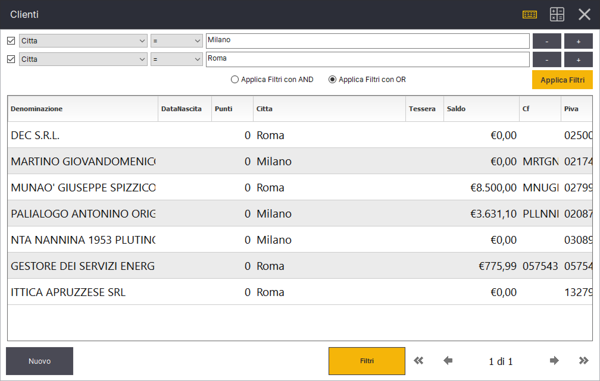

# Filtri Elenchi

Tutti gli elenchi (Clienti, Fornitori, Articoli, Promozioni, ecc.) dispongono della funzione **Filtri**. Accedendo a tale funzione, puoi creare una serie di condizioni sulle colonne disponibili in ogni elenco. Questo ti consente di filtrare e individuare i dati che stai cercando molto velocemente.&#x20;

Analizziamo un caso di esempio: _vogliamo un elenco di tutti i clienti residendi nella cittá di milano o nella cittá di roma._&#x20;

Dalla maschera Gestione->Clienti premiamo il tasto Filtri presente nella parte inferiore.&#x20;

Ci viene presentato un elenco di colonne dal quale scegliere la colonna su cui applicare la condizione di filtro. In questo caso sceglieremo "Cittá". Nella seconda colonna indicheremo il tipo di condizione. In questo caso una condizione di uguaglianza (=). Nella casella di testo successiva indichiamo il valore del filtro, in questo caso "Milano".&#x20;

Clicca sul tasto **+** per aggiungere un secondo filtro e indica questa volta "Roma" nel valore del filtro.&#x20;

Seleziona l'opzione **Applica Filtri con OR** perché vogliamo visualizzare un cliente se soddisfa **almeno uno** dei due filtri indicati.&#x20;

Infine clicca sul tasto **Applica Filtri** per applicare tutti i filtri indicati.&#x20;

Puoi disattivare temporaneamente un filtro selezionando la checkbox nella parte sinistra e cliccando nuovamente su Applica Filtri. Puoi eliminare un filtro cliccando sul tasto meno.&#x20;

Lasciando la condizione **Applica Filtri con AND** vengono visualizzati solo i clienti che soddisfano **tutti i filtri** indicati.&#x20;
