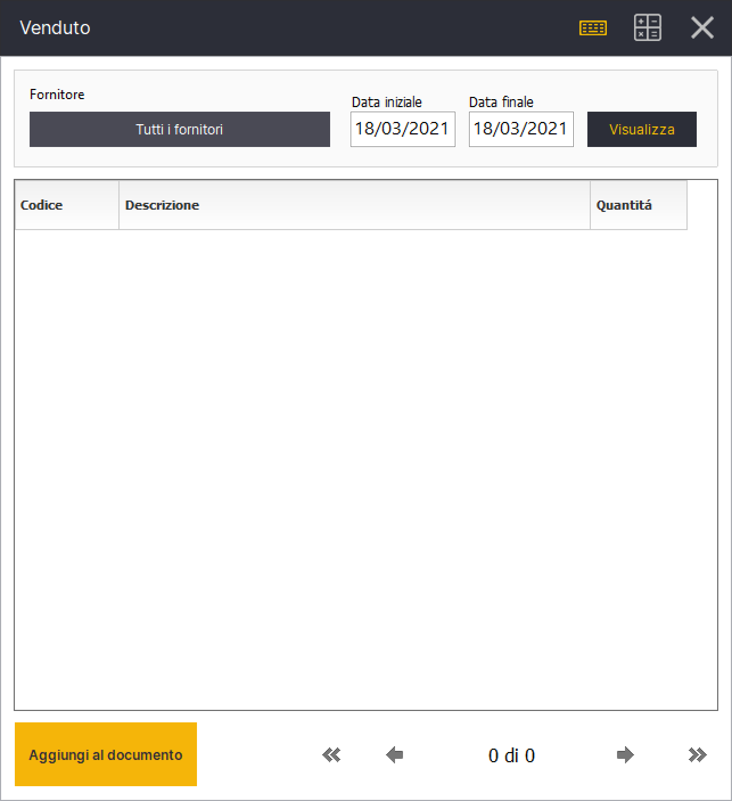

# Come creare un ordine fornitore dal venduto

## Requisiti

Per prima cosa devi abilitare il pulsante **Venduto**  nella sidebar. Per farlo vai nel menu:&#x20;

**Gestione->Impostazioni->Aspetto Interfaccia->Sidebar**&#x20;

ed imposta il valore 1 nella Colonna **Sidebar Cassa** in corrispondenza del codice **caVenduto**. Dopo aver riavviato Relax il pulsante apparirà nella sidebar:&#x20;

## Creazione Ordine Fornitore


&#x20;Assumiamo in questa sezione che il tipo documento Ordine Fornitore é stato attivato dalla fase Gestione->Impostazioni->Documenti


Dalla fase cassa clicca sul pulsante tipo documento e seleziona **Ordine Fornitore,** seleziona il fornitore e conferma.&#x20;

Successivamente clicca sul pulsante **Venduto** presente nella sidebar, attivato seguendo le istruzioni del paragrafo precedente.&#x20;

A questo punto devi specificare la data iniziale e la data finale e cliccare sul tasto **Visualizza.** Relax calcolerà la quantità totale di ogni articolo venduta nell'intervallo specificato, é possibile opzionalmente filtrare gli articoli per fornitore.

Infine, clicca sul tasto in basso **Aggiungi al documento** per aggiungere tutti i prodotti al documento ordine fornitore in precedenza creato nella fase cassa.&#x20;


Potrebbero essere presenti più pagine nel risultato della ricerca, il tasto "Aggiungi al documento" aggiungerà i prodotti di **tutte** le pagine. L'operazione potrebbe richiedere tempo nel caso di un numero di elevato di prodotti e non é interrompibile.&#x20;

