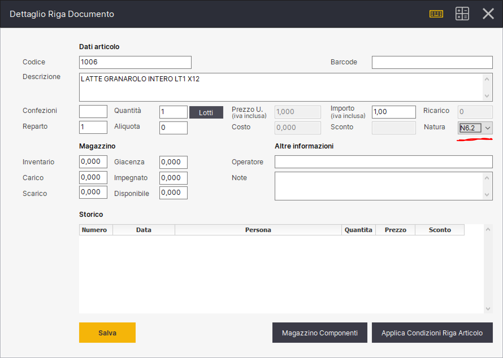

# Fatturazione Elettronica: elenco codici natura operazione

_**Il nuovo tracciato XML della fattura elettronica, obbligatorio dal 1 gennaio 2021,  prevede che i codici natura IVA N2, N3 ed N6 saranno validi solo fino al 31/12/2020.**_ Sono stati creati nuovi codici natura IVA specifici per dare maggiore dettaglio alle nature delle operazioni abolite (N2, N3 ed N6).

I codici natura IVA aggiornati con il tracciato in vigore dal primo gennaio 2021 sono i seguenti:

N1 - escluse ex art. 15

N2.1 non soggette ad IVA ai sensi degli art. da 7 a 7-septies del DPR 633/72

N2.2 non soggette - altri casi&#x20;

N3.1 non imponibili - esportazioni

N3.2 non imponibili - cessioni intra comunitarie

N3.3 non imponibili - cessioni verso San Marino

N3.4 non imponibili - operazioni assimilate alle cessioni all'esportazione

N3.5 non imponibili - a seguito di dichiarazioni d'intento

N3.6 non imponibili - altre operazioni che non concorrono alla formazione del plafond

N4 - esenti

N5 - regime del margine / IVA non esposta in fattura

N6.1 inversione contabile - cessione di rottami e altri materiali di recupero

N6.2 inversione contabile - cessione di oro e argento puro

N6.3 inversione contabile - subappalto nel settore edile

N6.4 inversione contabile - cessione di fabbricati

N6.5 inversione contabile - cessione di telefoni cellulari

N6.6 inversione contabile - cessione di prodotti elettronici

N6.7 inversione contabile - prestazioni comparto edile e settori connessi

N6.8 inversione contabile - operazioni settore energetico

N6.9 inversione contabile - altri casi&#x20;

N7 - IVA assolta in altro stato UE (vendite a distanza ex art. 40 c. 3 e 4 e art. 41 c. 1 let. b,  DL 331/93; prestazione di servizi di telecomunicazioni, tele-radiodiffusione ed elettronici ex art. 7 let. f, g, art. 74- DPR 633/72).

_I codici natura IVA N2, N3 ed N6 saranno validi solo fino al 31/12/2020._

In Relax puoi cambiare la natura dell'operazione entrando nel dettaglio di ogni riga documento: &#x20;

