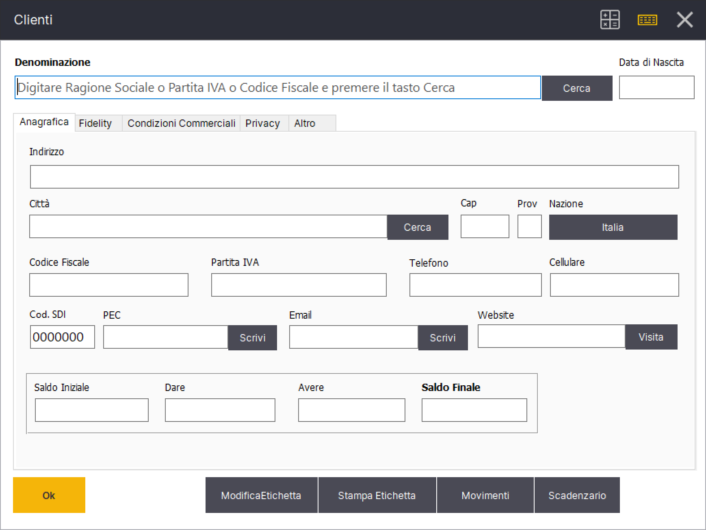

# Integrazione con Cerved

Relax é integrato con il servizio di ricerca anagrafiche aziende offerto da [Cerved](https://www.cerved.com/).

Per abilitare il servizio é necessario abilitare il modulo Cerved dal menu Gestione->Impostazioni->Moduli.

Nelle sezioni Clienti/Fornitori sará presente un nuovo tasto **Cerca** a lato del campo Denominazione che permette di effettuare una ricerca tramite Cerved.&#x20;

<figure><figcaption>
Inserimento anagrafiche tramite servizio Cerved
</figcaption></figure>
