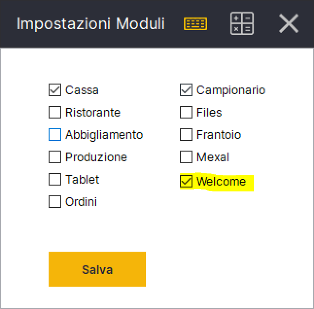
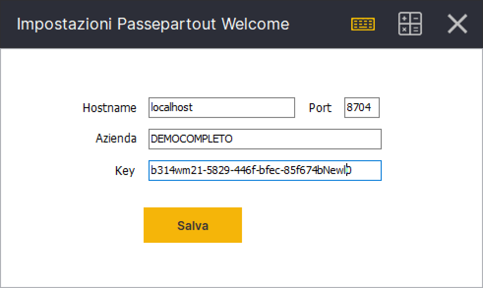
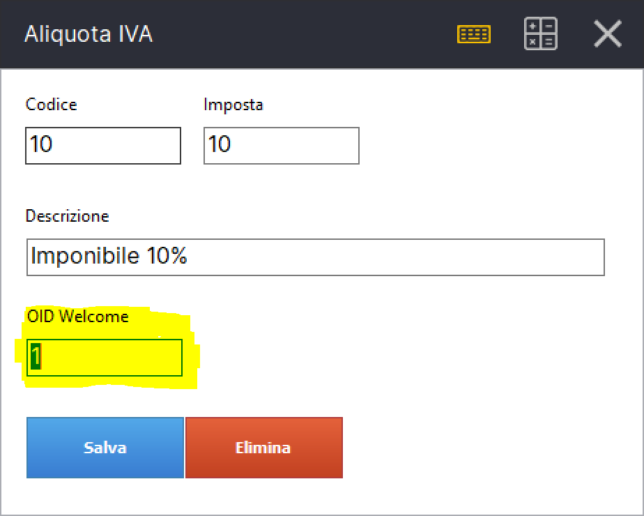
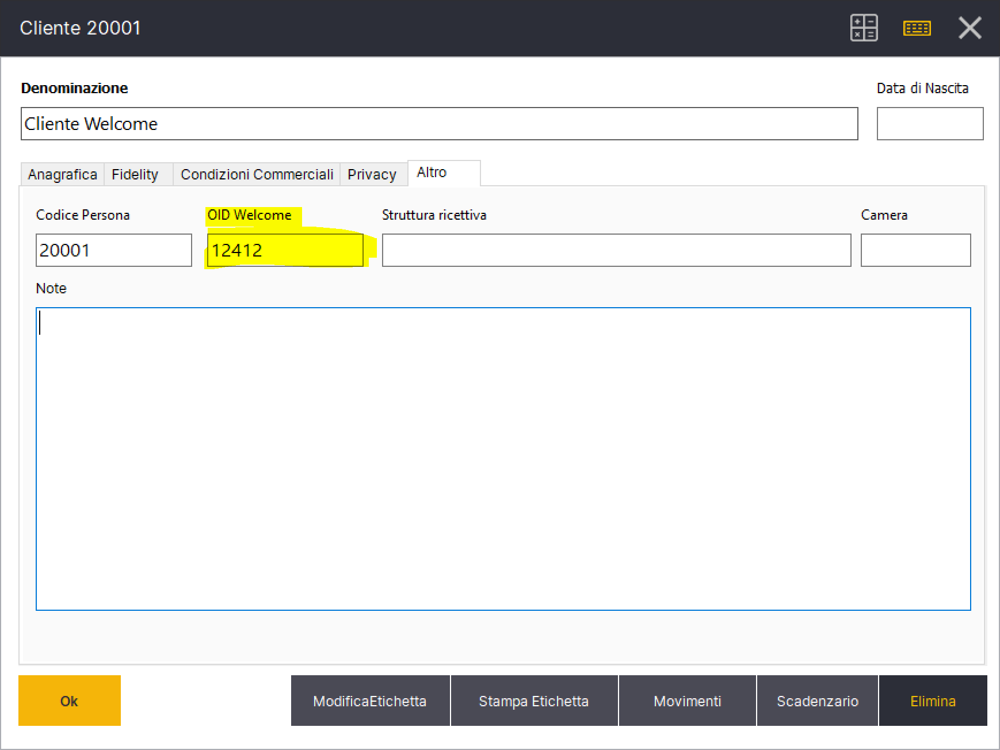
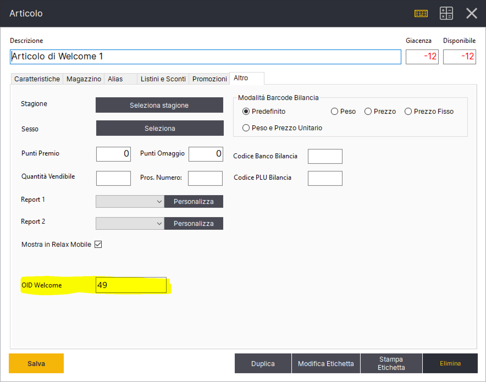
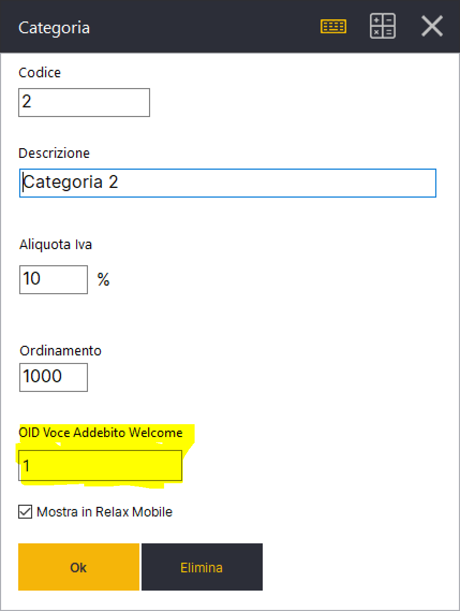
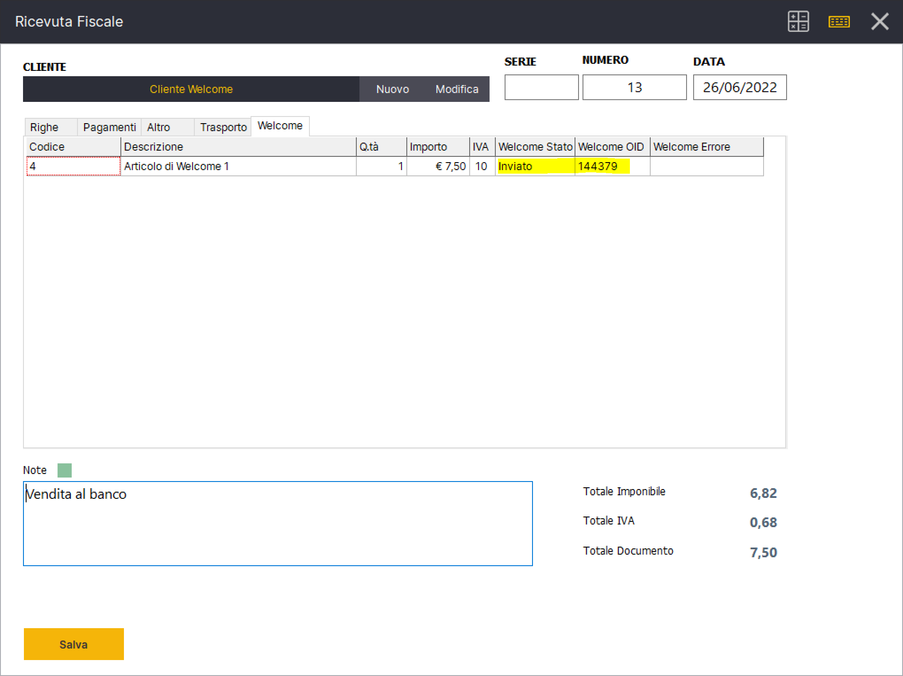
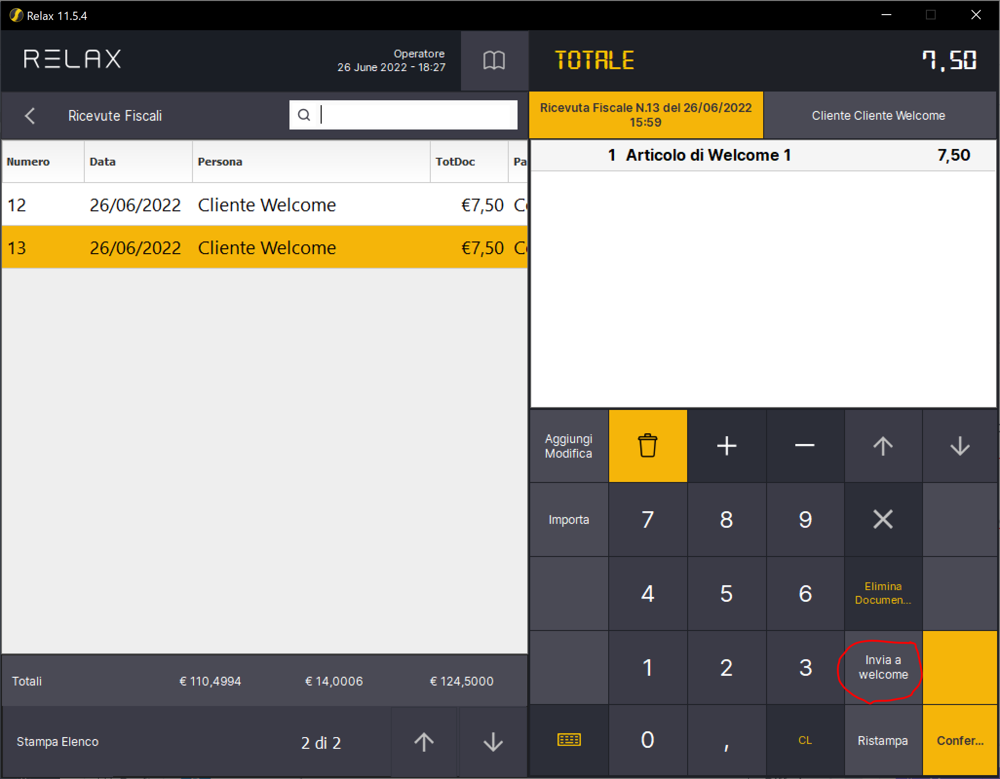

# Integrazione con Passepartout Welcome

Per prima cosa devi attivare il modulo Welcome dal menu Gestione->Impostazioni-> Moduli

Accedi ora alle Impostazioni di Welcome da Gestione->Impostazioni->Welcome

Welcome utilizza un object id (OID) per identificare ciascun record (clienti, articoli, aliquote, addebiti, ecc). La prima cosa da fare é indicare l'OID di ciascuna aliquota IVA utilizzata in Relax. Vai nella fase Gestione->Tabelle->Aliquote. Seleziona ciascuna aliquota ed indica l'OID welcome.&#x20;

Per inviare gli addebiti a Welcome si utilizza il documento Ricevuta Fiscale. Il documento deve essere associato ad un cliente. Nell'anagrafica del cliente devi quindi indicare l'OID di welcome (Gestione->Tabelle->Clienti->Seleziona il cliente e accedi alla scheda Altro).&#x20;

Ciascuna riga del documento Relax ricevuta fiscale diventerá un addebito in Welcome. L'articolo della riga documento é legato ad un articolo che deve avere in anagrafica il relativo OID welcome (Gestione->Tabelle->Articoli->Seleziona Articolo->Scheda Altro)

L'articolo va inoltre associato ad una categoria articolo relax, che a sua volta avrá un OID della voce addebito di welcome associata. (Gestione->Tabelle->Categorie)


Tutti gli articoli a cui é stato associato un OID Welcome devono avere obbligatoriamente una categoria assegnata, la quale a sua volta deve avere un OID Voce Addebito Welcome valido.


A questo punto abbiamo tutti gli elementi per inviare un documento a Welcome. Dalla fase cassa crea una **Ricevuta Fiscale**, assegna il cliente ed aggiungi uno o piú articoli. Confermando il documento verrá automaticamente inviato un addebito per ogni riga documento associata ad un articolo con OID Welcome valorizzato.


Le righe documento associate ad articoli che non hanno il campo Welcome OID valorizzate non verranno inviate a Welcome.&#x20;


In caso di errori in fase di invio a Welcome é possibile visualizzare ulteriori dettagli sulla causa dell'errore dalla fase Gestione-> Vendite-> Ricevute Fiscali-> Seleziona la ricevuta fiscale-> Cliccare sul display per aprire dettaglio documento -> Scheda Welcome.&#x20;

Nella colonna Welcome OID é possibile trovare l'OID associato all'addebito generato da Relax. Nel caso in cui il documento presenti degli articoli senza OID Welcome, le relative righe presenteranno nella colonna Welcome Stato il valore **Non Inviato.** Se successivamente si associa un OID agli articoli si puó reinviare lo stesso documento a Welcome. Relax invierá a Welcome soltanto le righe non ancora inviate. In caso di errori nella colonna Welcome Errore verrá visualizza la risposta dell'API Welcome con ulteriori dettagli sulla causa dell'errore.&#x20;

Per inviare le righe non ancora inviate a Welcome puoi procedere dalla fase Gestione->Vendite->Ricevute Fiscali. Seleziona la ricevuta fiscale e clicca il pulsante Invia a Welcome nella parte destra.&#x20;

Se l'operazione va a buon fine non verrá visualizzato nessun messaggio. In caso contrario é possibile rientrare nel dettaglio documento e visualizzare la causa del mancato invio dalla scheda Welcome.&#x20;

## API Welcome

[https://documenter.getpostman.com/view/12628329/UVeJM5yb](https://documenter.getpostman.com/view/12628329/UVeJM5yb)

