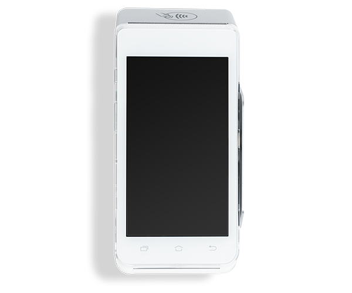
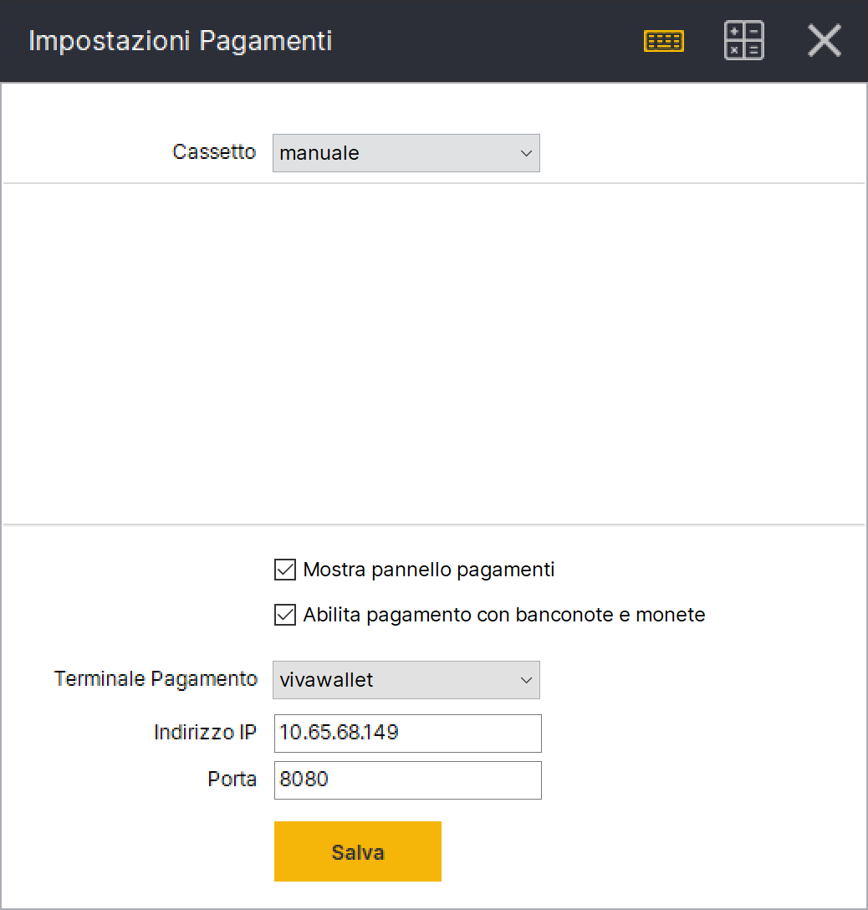
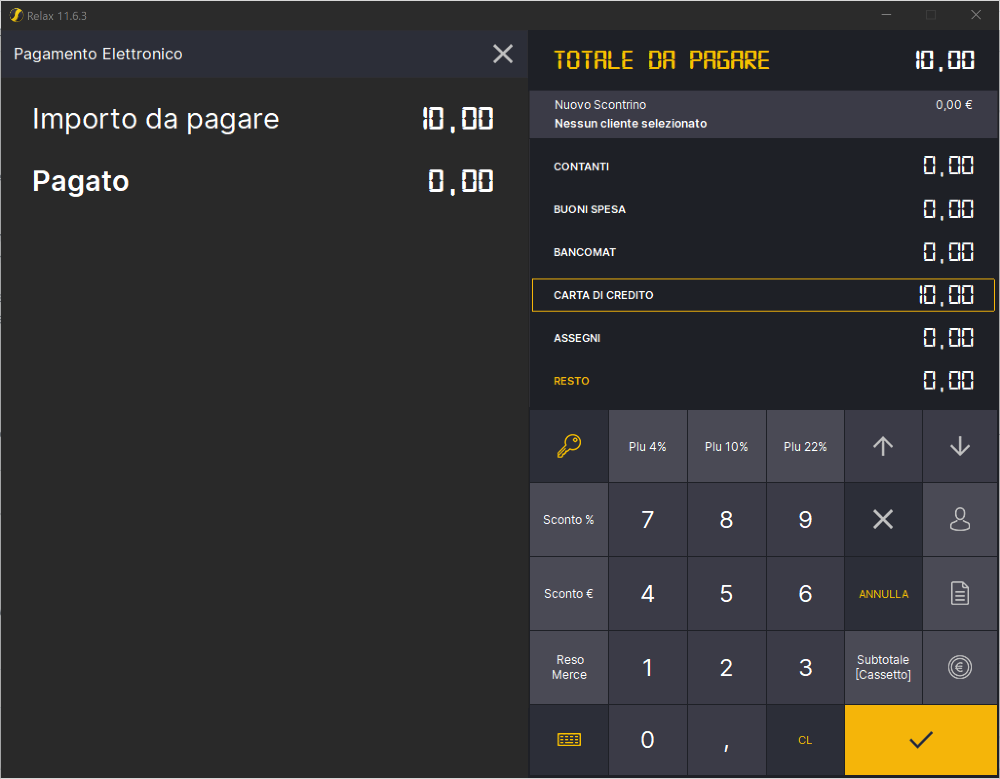
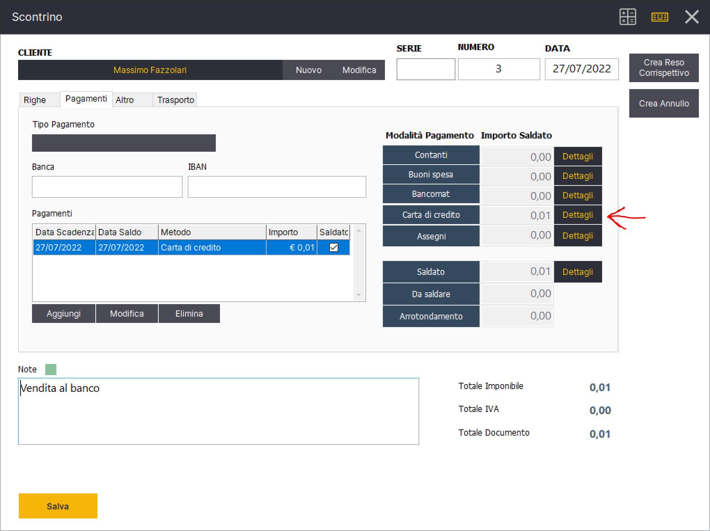
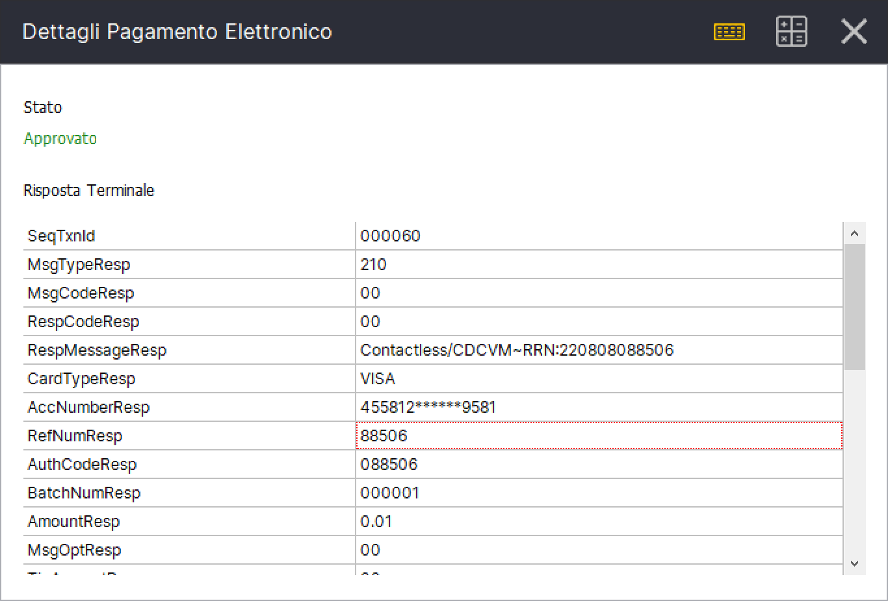

# Integrazione con Viva Wallet

In questa sezione viene descritto come configurare il POS Viva Wallet con il gestionale per la vendita al dettaglio Relax.&#x20;

Utilizziamo il modello PAX A910 di Viva Wallet.&#x20;

Come primo passo devi impostare il terminale Viva Wallet in modalitá ECR. Per farlo apri il menu in alto a sinistra e seleziona `System`

.jpeg>)

Seleziona ora la voce `Settings`

&#x20;

.jpeg>)

Di default il terminale é impostato nella modalitá `Standalone` seleziona per cambiare in modalitá `ECR/ERP Support`

A questo punto puoi selezionare il tasto indietro per tornare alla schermata precedente nella quale puoi ricavare l'indirizzo IP e la porta che ti servirá indicare in Relax successivamente in questa guida. Prendi nota.&#x20;

Seleziona il tasto indietro per tornare alla schermata iniziale. Se tutto é andato a buon fine potrai vedere, nella parte in alto a destra, la dicitura `ECR`

Possiamo ora passare alla configurazione di Relax. Vai nella sezione `Gestione->Impostazioni->Pagamenti`ed imposta come terminale pagamento `vivawallet`.  Indica l'indirizzo IP e la porta annotati in precedenza.

Salva le impostazioni e torna alla schermata di Cassa. Da questo momento quando si seleziona il tipo pagamento Carta di Credito o Bancomat Relax invierá automaticamente l'importo della transazione al POS Viva Wallet.&#x20;

A pagamento effettuato Relax chiude e salva automaticamente il documento. Per visualizzare i dettagli della transazione con moneta elettronica apri il dettaglio documento in Gestione. Nella tab Pagamenti clicca il tasto `Dettagli` a fianco del pagamento elettronico&#x20;

Ti verrá presentata una schermata con tutti i dettagli della transazione elettronica restituiti dal terminale Viva Wallet.&#x20;

