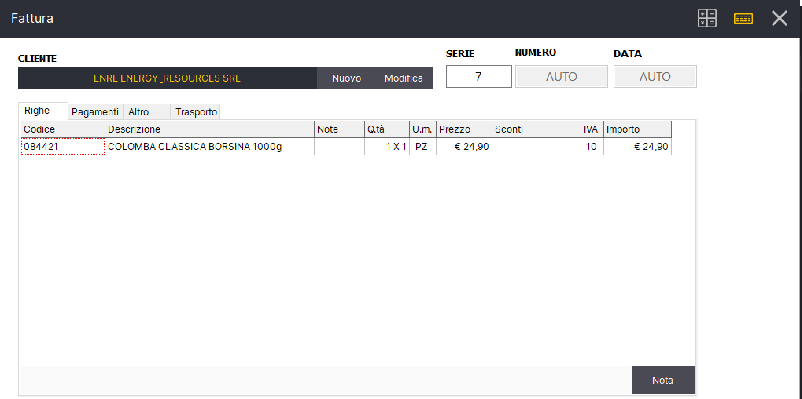
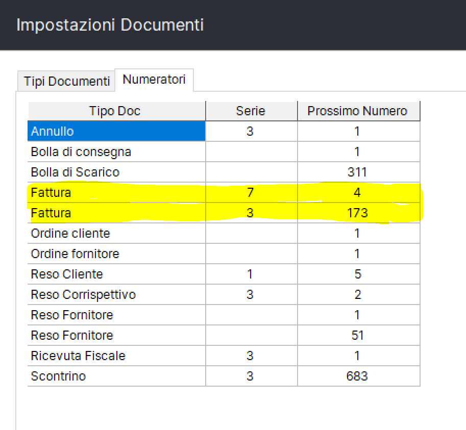

# Numeratori separati

Il numero del documento é preceduto da un numero di serie per differenziare i documenti emessi (Per esempio per reparto, per venditore, ecc).&#x20;

Entrando nel dettaglio del documento si puó modificare il campo **Serie**

In fase di salvataggio del documento, se la serie non esiste verrá creato un nuovo numeratore associato alla serie indicata. Ad ogni coppia tipo documento/serie é associato un numeratore che viene incrementato automaticamente per ogni documento emesso.&#x20;

Per visualizzare i numeratori andare nella fase Gestione->Impostazioni->Documenti->Numeratori

