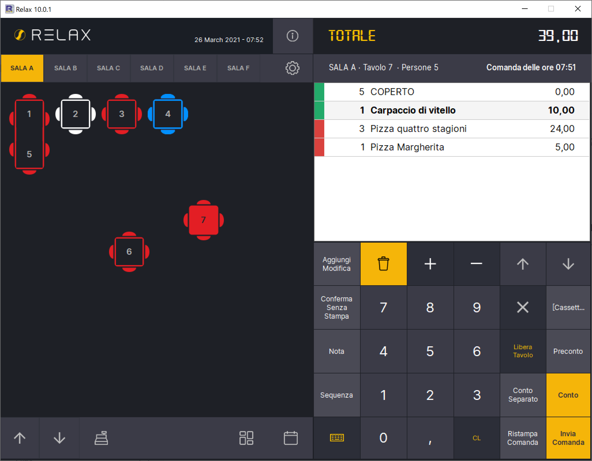

# Preparazione Comanda

Per abilitare la preparazione della comanda lato cucina devi per prima cosa impostare il flag "Abilita Preparazione Comanda" sull'operatore, andando nella fase:

**Gestione -> Operatori -> Seleziona Operatore -> Scheda Altro**

Dalla maschera dei tavoli, selezionando una riga della comanda questa passerà dallo stato di Confermata alla cucina (Rosso) allo stato Preparata (Verde). Toccando nuovamente la riga lo stato passerà nuovamente a Rosso, in questo modo puoi annullare la preparazione della comanda.&#x20;

